# Endnutzer Dokumentation

### Autoren
1. **Tom Weber** *(Dokumentationsteil: Allgemein, Student)*
2. **Paulina Clauss** *(Dokumentationsteil: Lehrender)*
3. **Monika Pjano** *(Dokumentationsteil: Admin)*

### Reviewer (Prüfer)
1. **Luca Baeck**
2. **Okan Soenmez**
3. **Leon Priemer**
4. **Iven Stahl**
5. **Max Meinel**

---

## 0. Allgemein

**Voraussetzungen für den Systemzugang**
Um sich an der Plattform anmelden zu können, ist ein gültiges Benutzerkonto im zentralen Identitätsmanagementsystem (Keycloak) zwingend erforderlich. Dies gilt ausnahmslos für alle Benutzergruppen.

Damit der Login erfolgreich durchgeführt werden kann, müssen in Keycloak folgende Attribute zwingend hinterlegt sein:
* Vorname
* Nachname
* E-Mail-Adresse
* Zugewiesene Rolle (Student, Lehrer oder Admin)

Fehlt eine dieser Informationen, wird die Anmeldung vom System blockiert.

**Hinweis zur Struktur dieser Dokumentation**
Diese Endnutzer-Dokumentation ist strikt nach Rollen getrennt aufgebaut. Jede Sektion (Student, Lehrer, Admin) ist als eigenständige und vollumfängliche Anleitung konzipiert.

Aufgrund dieses Aufbaus kann es zu inhaltlichen Dopplungen zwischen den einzelnen Kapiteln kommen. Dies ist bewusst so gewählt: Jede Nutzergruppe erhält genau die Informationen, die für sie relevant sind, ohne bei funktionsübergreifenden Themen zwischen verschiedenen Teilen des Dokuments hin- und herspringen zu müssen.

---

### Rechte- und Rollenübersicht

Die folgende Tabelle gibt einen schnellen Überblick über die Berechtigungen der verschiedenen Benutzerklassen innerhalb des App Stores.

| Funktion / Aktion | Student | Lehrer | Admin |
| :--- | :---: | :---: | :---: |
| Login am System (via Keycloak) | ✅ | ✅ | ✅ |
| Eigene OpenStack-Credentials hinterlegen & verwalten | ✅ | ✅ | ✅ |
| Öffentliche Apps einsehen | ✅ | ✅ | ✅ |
| Private Apps einsehen | ✅ (Nur eigene) | ✅ (Nur eigene) | ✅ (Alle) |
| Neue Apps hinzufügen (zur Prüfung einreichen) | ✅ | ✅ | ✅ |
| Sichtbarkeit einer App auf "Privat" stellen | ✅ (Nur eigene) | ✅ (Nur eigene) | ✅ |
| App-Versionen freigeben, ablehnen oder widerrufen | ❌ | ❌ | ✅ |
| Neue Deployments konfigurieren und starten | ❌ | ✅ | ✅ |
| Eigene Deployments einsehen | ❌ | ✅ | ✅ |
| Alle Deployments (von sämtlichen Nutzern) einsehen | ❌ | ❌ | ✅ |
| Eigene Logindaten in zugewiesenen Deployments einsehen | ✅ | ✅ | ✅ |
| Logindaten aller Mitglieder eines Deployments einsehen | ❌ | ✅ (als Besitzer) | ✅ |
| Kurse erstellen und Mitglieder verwalten | ❌ | ✅ | ✅ |

---

## 1. Studenten

Willkommen im App Store! Diese Dokumentation führt dich durch die wichtigsten Funktionen, die dir als Student in der Plattform zur Verfügung stehen.

---

### Login und Dashboard

Der Einstieg in die Plattform erfolgt über den regulären Login. Du kannst dich entweder mit deinem **Benutzernamen und Passwort** oder deiner **E-Mail-Adresse und Passwort** anmelden.

<figure style="margin-bottom: 30px;">
  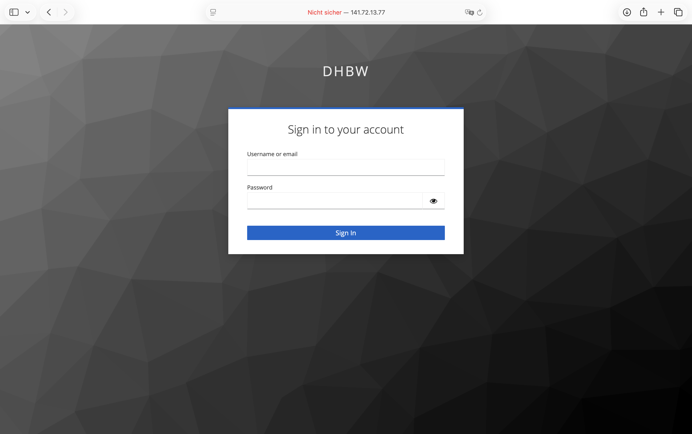
  <figcaption style="font-size: 0.9em; color: #555;">Keycloak Login</figcaption>
</figure>

Nach erfolgreichem Login landest du direkt auf dem **Dashboard**. Hier erhältst du einen schnellen Überblick über:
* Deine zugewiesenen Deployments und verfügbaren Apps.
* Deine verfügbaren und genutzten OpenStack-Ressourcen (z. B. VMs, RAM, Storage, Floating IPs).

<figure style="margin-bottom: 30px;">
  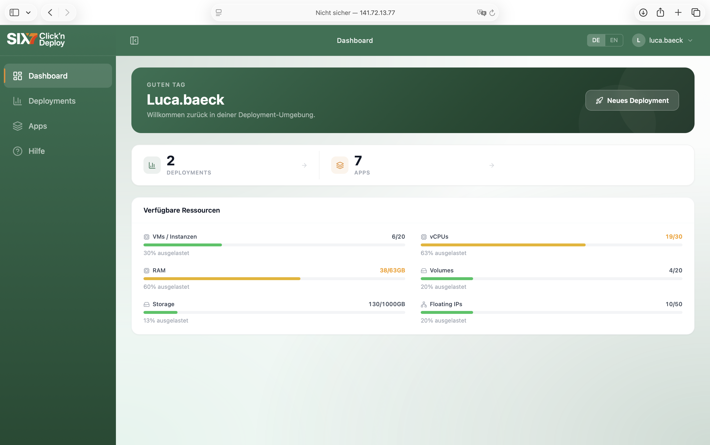
  <figcaption style="font-size: 0.9em; color: #555;">Dashboard: Mit OpenStack-Credentials</figcaption>
</figure>

**Erstanmeldung:** Wenn du dich zum ersten Mal anmeldest, fehlen dem System noch deine OpenStack-Zugangsdaten. Dies wird dir direkt oben auf dem Dashboard durch einen gelb hinterlegten Hinweis ("OpenStack-Credentials fehlen") signalisiert. Klicke dort auf den Button **Jetzt einrichten**, um deine Daten zu hinterlegen.

<figure style="margin-bottom: 30px;">
  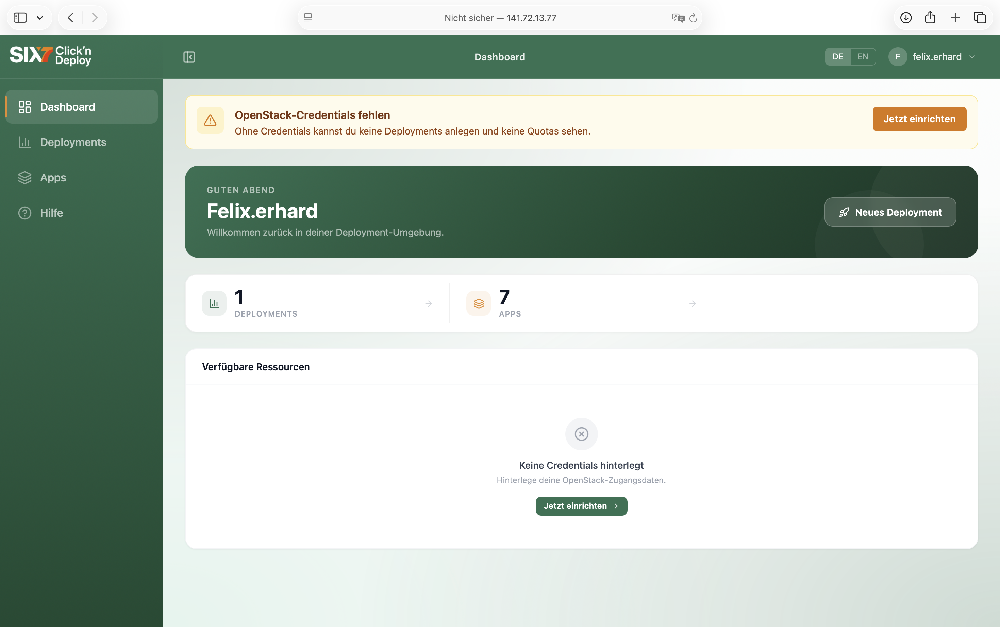
  <figcaption style="font-size: 0.9em; color: #555;">Dashboard: Hinweis auf fehlende OpenStack-Credentials</figcaption>
</figure>

---

### OpenStack-Credentials hinterlegen

Um die Ressourcen der Plattform nutzen zu können, müssen deine Credentials gültig sein. Auf der Einrichtungsseite hast du zwei Möglichkeiten:
1. **Manuelle Eingabe:** Trage die Daten (Auth-URL, Region, Username etc.) händisch in die entsprechenden Felder ein.
2. **Datei-Upload (Empfohlen):** Ziehe einfach deine `clouds.yaml`-Datei per Drag & Drop in das gestrichelte Feld oder klicke auf "Datei auswählen". Die Felder werden daraufhin automatisch ausgefüllt. Du musst lediglich noch dein persönliches Passwort eingeben.

Sobald die Daten gespeichert sind, prüft das System diese. Oben links erscheint ein grüner Status **"Credentials gültig"**. Du kannst die Verbindung jederzeit über den Button **Erneut testen** aktualisieren oder die Daten über **Löschen** komplett entfernen.

> **Ausnahmefall:** Solltest du aus der Vergangenheit bereits Deployments besitzen, aber keine gültigen Credentials mehr hinterlegt haben, musst du zunächst alle aktuellen Deployments löschen, bevor du neue Credentials hinzufügen kannst.

<figure style="margin-bottom: 30px;">
  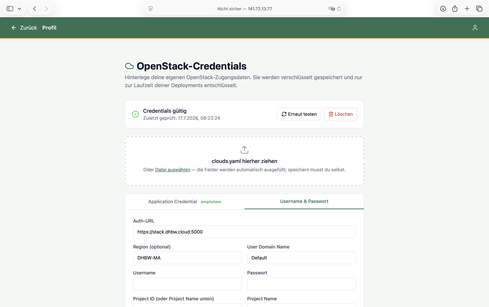
  <figcaption style="font-size: 0.9em; color: #555;">Profil-Einstellungen: Credentials hochladen oder manuell eintragen</figcaption>
</figure>

---

### Profil und Einstellungen

Klickst du oben rechts auf dein **Nutzer-Icon**, öffnet sich ein kleines Menü. Hier kannst du dich **abmelden** oder dein **Profil** aufrufen.

In der Profilansicht siehst du alle relevanten Account-Daten auf einen Blick:
* Vorname, Nachname und E-Mail-Adresse
* Deinen zugewiesenen Kurs
* Deine Rolle (Student)
* Registrierungsdatum sowie System-IDs (Benutzer-ID und Keycloak-ID)

Zusätzlich findest du hier unter dem Punkt "Einstellungen" jederzeit den Link zu deinen **OpenStack-Credentials**, falls du diese nachträglich anpassen musst. Über den "Zurück"-Button oben links gelangst du wieder auf das Dashboard.

<figure style="margin-bottom: 30px;">
  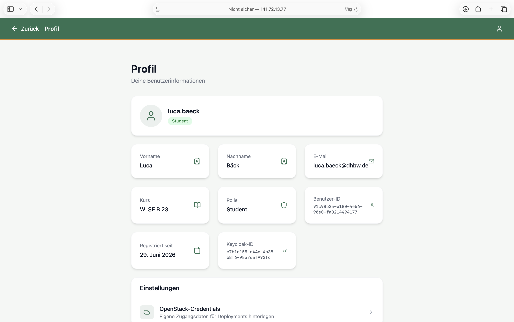
  <figcaption style="font-size: 0.9em; color: #555;">Profil: Übersicht der eigenen Benutzerdaten</figcaption>
</figure>

---

### Apps anlegen und einreichen

Über den Menüpunkt **Apps** in der linken Seitenleiste (oder den Fastlink auf dem Dashboard) gelangst du zur App-Übersicht. Als Student hast du die Möglichkeit, neue Apps hinzuzufügen und zur Überprüfung vorzuschlagen.

1. Klicke in der App-Übersicht oben rechts auf den Button **+ App hinzufügen**.
2. Vergib einen **Namen** und trage eine **Beschreibung** ein (Markdown wird hierbei unterstützt, eine Live-Vorschau hilft dir bei der Formatierung).
3. (Optional) Lade ein App-Logo hoch.
4. Füge den **Link zu deinem GitHub-Repository** (als HTTPS-Link) ein.
5. **Sichtbarkeit:** Du kannst zwischen **Öffentlich** und **Privat** wählen. "Privat" eignet sich besonders gut, wenn du eine App gerade erst entwickelst und sie zunächst nur anlegen möchtest. **Wichtiger Hinweis:** Auch wenn du eine App auf "Privat" stellst, hast du als Student *nicht* die Berechtigung, selbst ein Deployment dafür zu starten. Wählst du hingegen "Öffentlich", wird die App nach einer Prüfung durch einen Admin für alle Nutzer im Store sichtbar.
6. Hake die Option **"Alle Versionen einreichen"** an, damit deine Git-Tags als Versionen an einen Admin zur Überprüfung (Review) gesendet werden.
7. **GitHub Collaborator (nur bei privaten Repositories):** Wenn dein verlinktes GitHub-Repository *privat* ist, musst du zwingend den technischen User `six7-click-n-deploy` als Collaborator zu deinem Repository hinzufügen. Bei einem öffentlichen Repository kannst du diesen Schritt überspringen. 
8. Klicke abschließend auf **Hinzufügen**. Die App taucht nun in der Übersicht auf und wartet (sofern sie öffentlich ist) auf die Freigabe durch einen Administrator.

<figure style="margin-bottom: 30px;">
  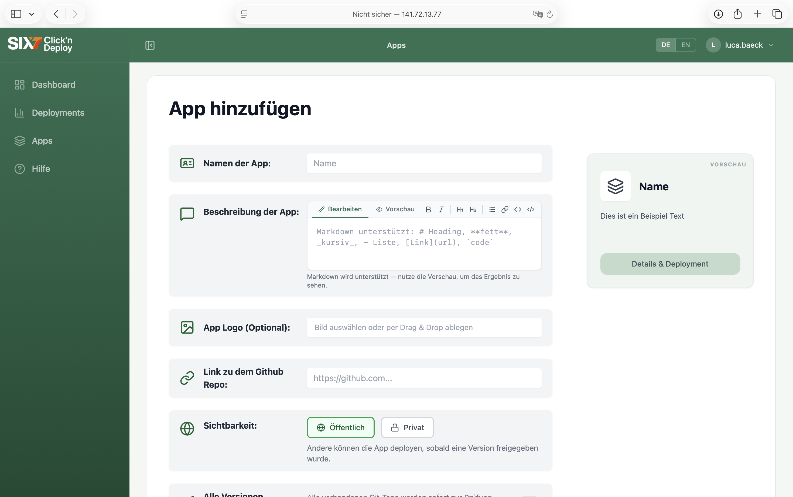
  <figcaption style="font-size: 0.9em; color: #555;">App hinzufügen: Einreichen einer neuen App für den Store</figcaption>
</figure>

---

### App-Details einsehen

Wenn du in der App-Übersicht auf eine der angezeigten Kacheln klickst, öffnet sich die Detailseite der jeweiligen App. Diese Seite bietet dir einen umfassenden Einblick in die Anwendung und ihre Releases.

**Allgemeine Übersicht (Kopfbereich):**
Direkt oben auf der Seite siehst du neben dem Namen und dem Logo der App auf einen Blick, **wie viele Versionen verfügbar** sind. Daneben findest du auch den direkten **Link zum dazugehörigen GitHub-Repository**.

**Die App-Beschreibung (Vom Entwickler definiert):**
Der große Hauptbereich der Seite beinhaltet die allgemeine Beschreibung der App. **Wichtig zu wissen:** Diese Inhalte werden vom jeweiligen App-Entwickler (Admin/Lehrer) beim Erstellen der App frei festgelegt. Je nach App kannst du hier unterschiedliche, spezifische Informationen finden, wie zum Beispiel:
* Erklärungen zu Features, dem User-Management oder dem VM-Deployment
* Schätzungen zur Deployment-Dauer
* Erklärungen zu konfigurierbaren Variablen oder benötigten Aufgabendateien

**Feste Metadaten und Versionsinfos:**
Im unteren Bereich der Seite findest du fest definierte Blöcke mit Systeminformationen:
* **App Informationen:** Zeigt an, wann und von wem die App initial erstellt wurde.
* **Versionsdetails:** Liefert technische Daten zur aktuell ausgewählten Version (z. B. Typ, Commit-Hash, Autor, Veröffentlichungsdatum und Link zum Release).
* **Versionsbeschreibung:** Beinhaltet spezifische Notizen oder Release Notes, die genau zu der ausgewählten Version gehören.

**Versionsauswahl und Deployment-Funktion:**
Auf der rechten Seite deines Bildschirms befindet sich eine fixierte Box zur Versionssteuerung.

Über das Dropdown-Menü **Version auswählen** kannst du durch alle verfügbaren Releases der App navigieren. Sobald du eine andere Version auswählst, aktualisieren sich die Blöcke "Versionsdetails" und "Versionsbeschreibung" auf der linken Seite automatisch passend zu deiner Auswahl.

> **Wichtiger Hinweis zum "Jetzt Deployen"-Button:** Unter der Versionsauswahl befindet sich ein Button, um ein Deployment zu starten. Da du als Student keine Berechtigung für eigene Deployments hast, ist dieser Button für dich **gesperrt bzw. ohne Funktion**. Diese Ansicht dient für dich rein der Information; nur Lehrkräfte und Admins können den Deployment-Prozess tatsächlich auslösen.

<figure style="margin-bottom: 30px;">
  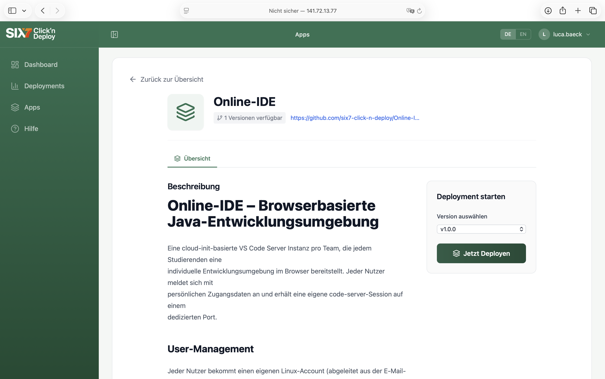
  <figcaption style="font-size: 0.9em; color: #555;">App-Details: Übersicht, Entwickler-Beschreibung und Versionsauswahl</figcaption>
</figure>
<figure style="margin-bottom: 30px;">
  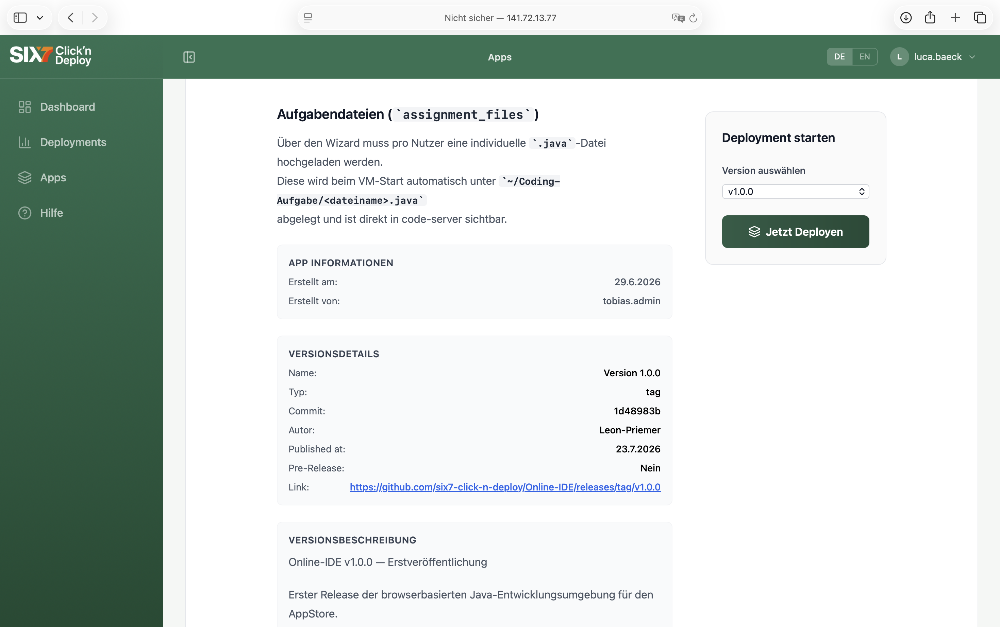
  <figcaption style="font-size: 0.9em; color: #555;">App-Details: Übersicht, Entwickler-Beschreibung und Versionsauswahl</figcaption>
</figure>

---

### Deployments und Zugangsdaten einsehen

**Wichtig:** Als Student kannst du *keine* eigenen Deployments starten oder konfigurieren. Diese Aufgabe übernehmen Lehrkräfte oder Admins für dich.

Du kannst jedoch über den Menüpunkt **Deployments** in der linken Seitenleiste (oder den Fastlink auf dem Dashboard) alle Deployments einsehen, denen du (bzw. dein Team) zugewiesen wurdest.

* **Übersicht:** Hier siehst du eine Liste der aktiven Deployments inklusive Status (z. B. "Erfolgreich").
* **Details & Zugangsdaten:** Klicke auf ein Deployment, um die Details zu öffnen. Du siehst Informationen zur genutzten App, dem Besitzer (Lehrkraft/Admin) und der Team-Zuteilung.
* **Zugang erneut senden:** In der Sektion "Teams & Mitglieder" findest du neben deinem Namen den Button **Zugang erneut senden**. Solltest du deine Logindaten für diese spezifische App (z. B. Benutzername und Passwort für eine Datenbank-Instanz) vergessen oder nicht erhalten haben, kannst du sie dir hierüber erneut zuschicken lassen.

<figure style="margin-bottom: 30px;">
  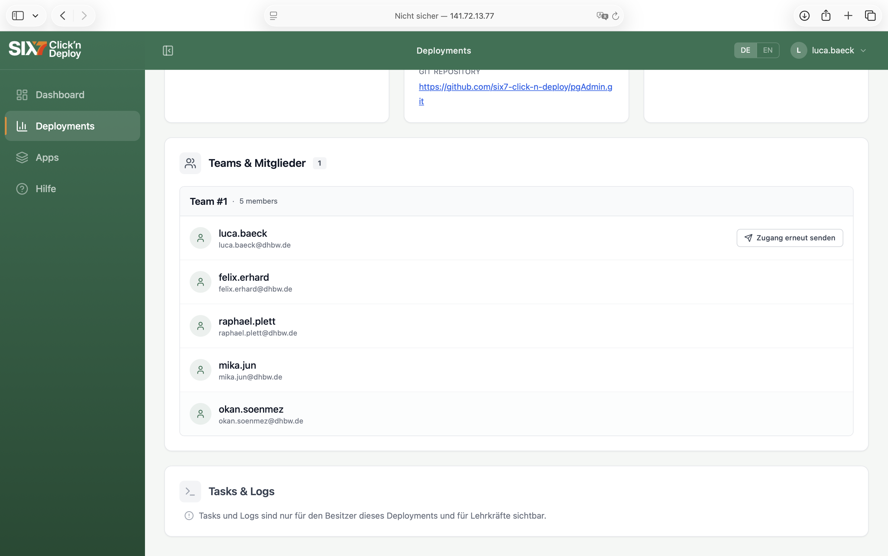
  <figcaption style="font-size: 0.9em; color: #555;">Deployments: Details einsehen und Logindaten erneut anfordern</figcaption>
</figure>

---

### Hilfe und Support

Solltest du einmal nicht weiterkommen, findest du ganz unten in der linken Seitenleiste den Punkt **Hilfe**.

Diese Seite dient als zentrale Anlaufstelle für Fragen und Probleme:
* **Wenn etwas nicht funktioniert:** Checklisten zur Fehlerbehebung (z. B. Überprüfung der Quota-Limits).
* **Schritt-für-Schritt-Anleitungen:** Erklärungen zu grundlegenden Prozessen der Plattform.
* **Nützliche Links:** Hier findest du Verlinkungen zum Projekt-Repository auf GitHub, zur technischen Dokumentation für Installation/Administration sowie Details zur Technologie-Architektur.

<figure style="margin-bottom: 30px;">
  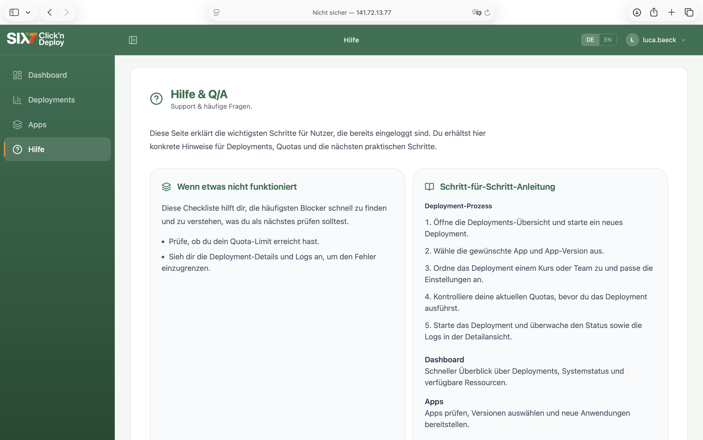
  <figcaption style="font-size: 0.9em; color: #555;">Hilfe & Q/A: Support, Anleitungen und weiterführende Links</figcaption>
</figure>

---

## 2. Lehrender

Willkommen im App Store! Diese Dokumentation führt dich durch die wichtigsten Funktionen, die dir als Lehrender in der Plattform zur Verfügung stehen.

---

### Login und Dashboard

Der Einstieg in die Plattform erfolgt über den regulären Login. Du kannst dich entweder mit deinem **Benutzernamen und Passwort** oder deiner **E-Mail-Adresse und Passwort** anmelden.

<figure style="margin-bottom: 30px;">
  
  <figcaption style="font-size: 0.9em; color: #555;">Keycloak Login</figcaption>
</figure>

Nach erfolgreichem Login landest du direkt auf dem **Dashboard**. Hier erhältst du einen schnellen Überblick über:
* Deine zugewiesenen Deployments und verfügbaren Apps und Kurse.
* Deine verfügbaren und genutzten OpenStack-Ressourcen (z. B. VMs, RAM, Storage, Floating IPs).

<figure style="margin-bottom: 30px;">
  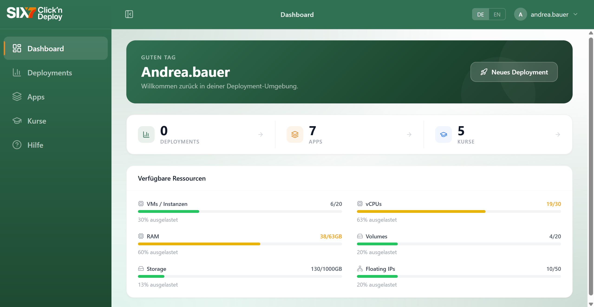
  <figcaption style="font-size: 0.9em; color: #555;">Dashboard mit Ressourcenverbrauch</figcaption>
</figure>

**Erstanmeldung:** Wenn du dich zum ersten Mal anmeldest, fehlen dem System noch deine OpenStack-Zugangsdaten. Dies wird dir direkt oben auf dem Dashboard durch einen gelb hinterlegten Hinweis ("OpenStack-Credentials fehlen") signalisiert. Klicke dort auf den Button **Jetzt einrichten**, um deine Daten zu hinterlegen.

<figure style="margin-bottom: 30px;">
  
  <figcaption style="font-size: 0.9em; color: #555;">Dashboard: Hinweis auf fehlende OpenStack-Credentials</figcaption>
</figure>

---

### OpenStack-Credentials hinterlegen

Um die Ressourcen der Plattform nutzen zu können, müssen deine Credentials gültig sein. Auf der Einrichtungsseite hast du zwei Möglichkeiten:
1. **Manuelle Eingabe:** Trage die Daten (Auth-URL, Region, Username etc.) händisch in die entsprechenden Felder ein.
2. **Datei-Upload (Empfohlen):** Ziehe einfach deine `clouds.yaml`-Datei per Drag & Drop in das gestrichelte Feld oder klicke auf "Datei auswählen". Die Felder werden daraufhin automatisch ausgefüllt. Du musst lediglich noch dein persönliches Passwort eingeben.

Sobald die Daten gespeichert sind, prüft das System diese. Oben links erscheint ein grüner Status **"Credentials gültig"**. Du kannst die Verbindung jederzeit über den Button **Erneut testen** aktualisieren oder die Daten über **Löschen** komplett entfernen.

> **Ausnahmefall:** Solltest du aus der Vergangenheit bereits zugewiesene Deployments besitzen, aber keine gültigen Credentials mehr hinterlegt haben, musst du zunächst alle aktuellen Deployments löschen, bevor du neue Credentials hinzufügen kannst. In diesem (seltenen) Fall erscheint ein blauer Hinweiskasten mit weiteren Instruktionen.

<figure style="margin-bottom: 30px;">
  
  <figcaption style="font-size: 0.9em; color: #555;">Profil-Einstellungen: Credentials hochladen oder manuell eintragen</figcaption>
</figure>

---

### Profil und Einstellungen

Klickst du oben rechts auf dein **Nutzer-Icon**, öffnet sich ein kleines Menü. Hier kannst du dich **abmelden** oder dein **Profil** aufrufen.

In der Profilansicht siehst du alle relevanten Account-Daten auf einen Blick:
* Vorname, Nachname und E-Mail-Adresse
* Deinen zugewiesenen Kurs
* Deine Rolle (Lehrender)
* Registrierungsdatum sowie System-IDs (Benutzer-ID und Keycloak-ID)

Zusätzlich findest du hier unter dem Punkt "Einstellungen" jederzeit den Link zu deinen **OpenStack-Credentials**, falls du diese nachträglich anpassen musst. Über den "Zurück"-Button oben links gelangst du wieder auf das Dashboard.

<figure style="margin-bottom: 30px;">
  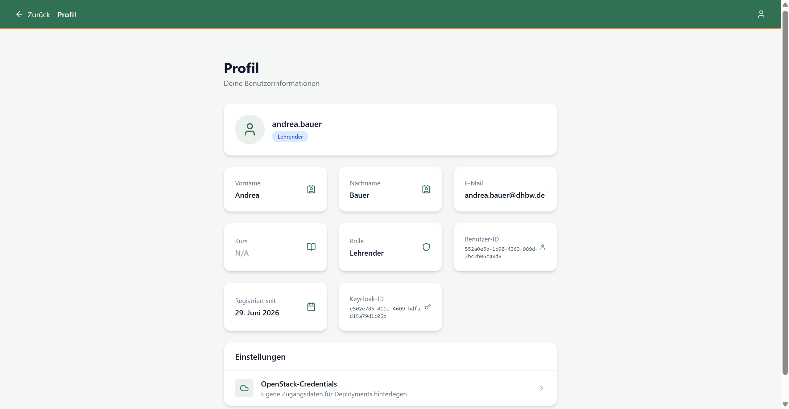
  <figcaption style="font-size: 0.9em; color: #555;">Profil: Übersicht der eigenen Benutzerdaten</figcaption>
</figure>

---

### Apps anlegen und einreichen

Über den Menüpunkt **Apps** in der linken Seitenleiste (oder den Fastlink auf dem Dashboard) gelangst du zur App-Übersicht. Als Lehrender hast du die Möglichkeit, neue Apps hinzuzufügen und zur Überprüfung vorzuschlagen.

1. Klicke in der App-Übersicht oben rechts auf den Button **+ App hinzufügen**.
2. Vergib einen **Namen** und trage eine **Beschreibung** ein (Markdown wird hierbei unterstützt, eine Live-Vorschau hilft dir bei der Formatierung).
3. (Optional) Lade ein App-Logo hoch.
4. Füge den **Link zu deinem GitHub-Repository** (als HTTPS-Link) ein.
5. **Sichtbarkeit:** Du kannst zwischen **Öffentlich** und **Privat** wählen. "Privat" eignet sich besonders gut, wenn du eine App gerade erst entwickelst und sie zunächst nur anlegen möchtest. 
6. Hake die Option **"Alle Versionen einreichen"** an, damit deine Git-Tags als Versionen an einen Admin zur Überprüfung (Review) gesendet werden.
7. **GitHub Collaborator (nur bei privaten Repositories):** Wenn dein verlinktes GitHub-Repository *privat* ist, musst du zwingend den technischen User `six7-click-n-deploy` als Collaborator zu deinem Repository hinzufügen. Bei einem öffentlichen Repository kannst du diesen Schritt überspringen. 
8. Klicke abschließend auf **Hinzufügen**. Die App taucht nun in der Übersicht auf und wartet (sofern sie öffentlich ist) auf die Freigabe durch einen Administrator.

<figure style="margin-bottom: 30px;">
  
  <figcaption style="font-size: 0.9em; color: #555;">App hinzufügen: Einreichen einer neuen App für den Store</figcaption>
</figure>

---

### App-Details einsehen

Wenn du in der App-Übersicht auf eine der angezeigten Kacheln klickst, öffnet sich die Detailseite der jeweiligen App. Diese Seite bietet dir einen umfassenden Einblick in die Anwendung und ihre Releases.

**Allgemeine Übersicht (Kopfbereich):**
Direkt oben auf der Seite siehst du neben dem Namen und dem Logo der App auf einen Blick, **wie viele Versionen verfügbar** sind. Daneben findest du auch den direkten **Link zum dazugehörigen GitHub-Repository**.

**Die App-Beschreibung (Vom Entwickler definiert):**
Der große Hauptbereich der Seite beinhaltet die allgemeine Beschreibung der App. **Wichtig zu wissen:** Diese Inhalte werden vom jeweiligen App-Entwickler (Admin/Lehrer) beim Erstellen der App frei festgelegt. Je nach App kannst du hier unterschiedliche, spezifische Informationen finden, wie zum Beispiel:
* Erklärungen zu Features, dem User-Management oder dem VM-Deployment
* Schätzungen zur Deployment-Dauer
* Erklärungen zu konfigurierbaren Variablen oder benötigten Aufgabendateien

**Feste Metadaten und Versionsinfos:**
Im unteren Bereich der Seite findest du fest definierte Blöcke mit Systeminformationen:
* **App Informationen:** Zeigt an, wann und von wem die App initial erstellt wurde.
* **Versionsdetails:** Liefert technische Daten zur aktuell ausgewählten Version (z. B. Typ, Commit-Hash, Autor, Veröffentlichungsdatum und Link zum Release).
* **Versionsbeschreibung:** Beinhaltet spezifische Notizen oder Release Notes, die genau zu der ausgewählten Version gehören.

**Versionsauswahl und Deployment-Funktion:**
Auf der rechten Seite deines Bildschirms befindet sich eine fixierte Box zur Versionssteuerung.

Über das Dropdown-Menü **Version auswählen** kannst du durch alle verfügbaren Releases der App navigieren. Sobald du eine andere Version auswählst, aktualisieren sich die Blöcke "Versionsdetails" und "Versionsbeschreibung" auf der linken Seite automatisch passend zu deiner Auswahl.

**Jetzt Deployen:** Unter der Versionsauswahl befindet sich ein Button, um ein Deployment zu starten. Über diesen gelangst du in den Deploymentprozess.

<figure style="margin-bottom: 30px;">
  
  <figcaption style="font-size: 0.9em; color: #555;">App-Details: Übersicht, Entwickler-Beschreibung und Versionsauswahl</figcaption>
</figure>

<figure style="margin-bottom: 30px;">
  
  <figcaption style="font-size: 0.9em; color: #555;">App-Details: Übersicht, Entwickler-Beschreibung und Versionsauswahl</figcaption>
</figure>

---

### Kurse verwalten

In der Kursverwaltung siehst du standardmäßig alle Kurse, die du selbst erstellt haben oder in denen du Mitglied bist.

**Neue Kurse anlegen:** Gibt es noch keine Kurse, klicke einfach auf **Kurs erstellen** oder **Ersten Kurs anlegen**. Trage im sich öffnenden Fenster den gewünschten Namen ein und bestätige mit **Erstellen**.

<figure style="margin-bottom: 30px;">
  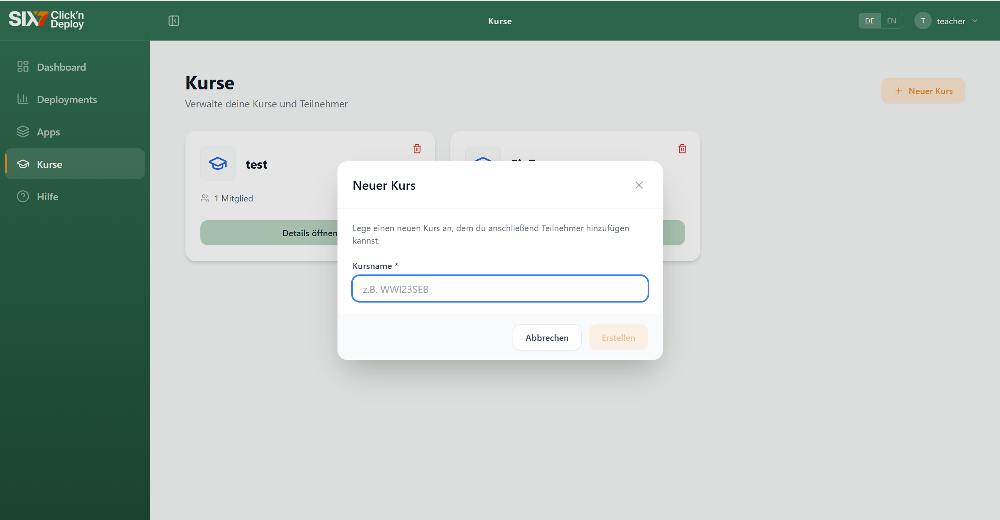
  <figcaption style="font-size: 0.9em; color: #555;">Kurs anlegen: Kursnamen auswählen</figcaption>
</figure>

**Mitglieder hinzufügen:** Öffne die Detailseite eines Kurses über **Details ansehen** oder direkt nach dem Erstellen. Mit einem Klick auf **Mitglied hinzufügen** öffnet sich eine Suchmaske. Hier kannst du gezielt nach E-Mail-Adressen oder Nutzernamen suchen, die gewünschten Studierenden auswählen und über **Hinzufügen** in den Kurs aufnehmen.

<figure style="margin-bottom: 30px;">
  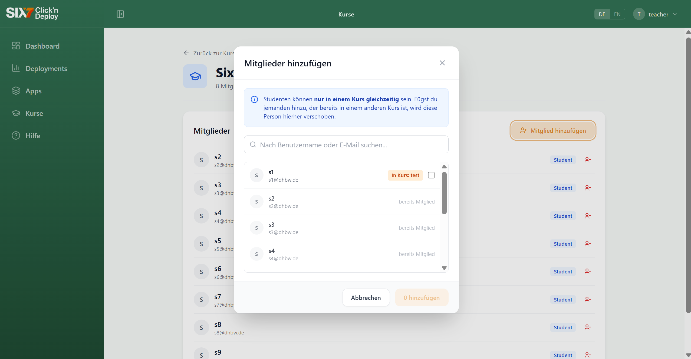
  <figcaption style="font-size: 0.9em; color: #555;">Kurs-Mitglieder hinzufügen: Studenten hinzufügen</figcaption>
</figure>

**Mitglieder entfernen:** Auf der Detailseite des Kurses siehst du eine Übersicht aller aktuellen Mitglieder. Rechts neben jedem Eintrag findest du die zugewiesene Rolle sowie ein Symbol, um das Mitglied aus dem Kurs zu entfernen.

<figure style="margin-bottom: 30px;">
  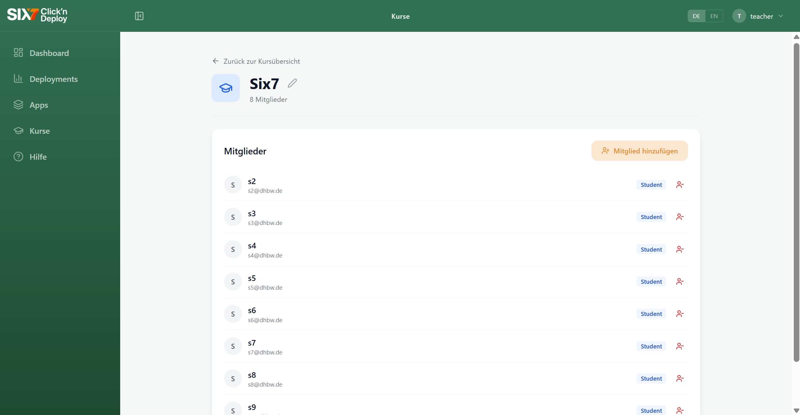
  <figcaption style="font-size: 0.9em; color: #555;">Kurs-Mitglieder-Übersicht: Auflistung der Mitglieder dieses Kurses</figcaption>
</figure>

**Kursnamen bearbeiten:** Oben auf der Detailseite findest du neben dem Kursnamen ein Stift-Symbol. Klicke darauf, um den Namen zu ändern. Bestätige deine Eingabe mit dem Haken oder verwerfe die Änderung mit dem Kreuz.

**Kurse löschen:** Auf der Übersichtsseite deiner Kurse befindet sich in jeder Kachel deiner Kurse ein Mülleimer-Symbol. Klicke darauf, um diesen Kurs zu löschen und bestätige mit klick auf Löschen.

> **Wichtiger Hinweis (Kurszuweisung):** Jeder Studierende kann immer nur in *einem* Kurs sein. Fügst du jemanden hinzu, der bereits in einem anderen Kurs eingetragen ist, wird die Person automatisch in den neuen Kurs verschoben und aus dem bisherigen entfernt.

<figure style="margin-bottom: 30px;">
  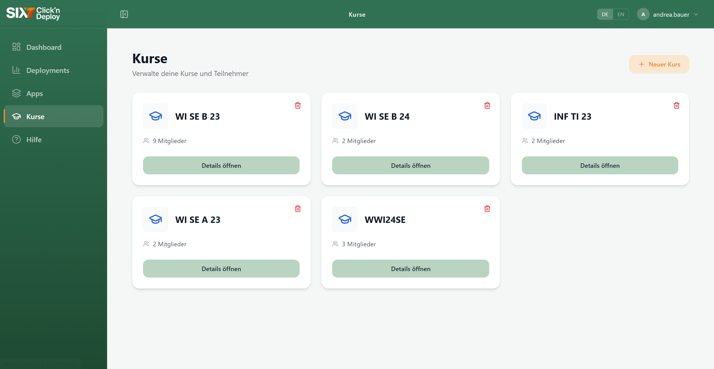
  <figcaption style="font-size: 0.9em; color: #555;">Auflistung der Kurse</figcaption>
</figure>

---

### Deployments

Über den Menüpunkt **Deployments** in der linken Seitenleiste findest du alle Deployments, die du erstellt hast.

### Deployments erstellen

> **Wichtiger Hinweis (Deployment erstellen):** Um ein Deployment zu erstellen, muss im Vorfeld bereits eine App angelegt und freigegeben worden sein.

1. Klicke in der Deployment-Übersicht oben rechts auf den Button **+ Neues Deployment**. 

<figure style="margin-bottom: 30px;">
  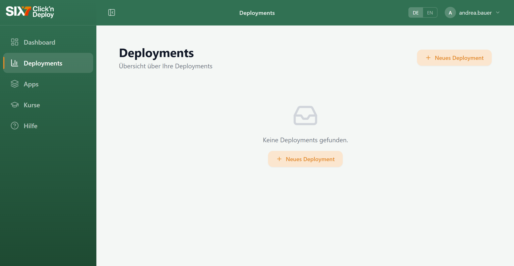
  <figcaption style="font-size: 0.9em; color: #555;">Deployment erstellen</figcaption>
</figure>

2. Wähle eine der bereits angelegten Apps aus, indem du auf **Details & Deployment** klickst. Auf der nun geöffneten App-Detail-Seite wählst du rechts die gewünschte Version aus und klickst auf **Jetzt Deployen**. 

<figure style="margin-bottom: 30px;">
  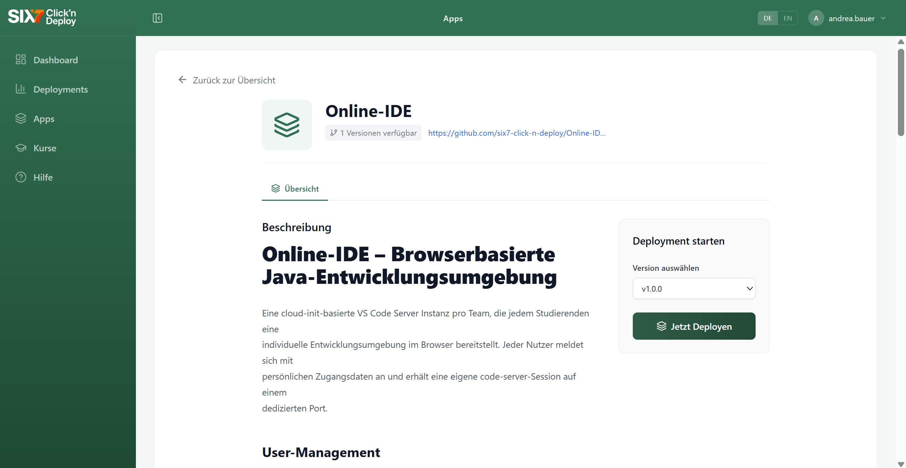
  <figcaption style="font-size: 0.9em; color: #555;">Deploymentprozess: App auswählen</figcaption>
</figure>

3. Vergib einem Namen für das Deployment und füge anschließend einen kompletten Kurs oder einzelne Studenten hinzu. Auf der linken Seite findest du, je nach ausgewählter Ansicht die verfügbaren Kurse oder eine Suchfunktion. Auf der rechten Seite werden die ausgewählten Studenten aufgelistet. Über das rote Kreuz neben dem jeweiligen Namen können Personen wieder entfernt werden. Klicke auf **Weiter**, um zum nächsten Schritt zu gelangen.

<figure style="margin-bottom: 30px;">
  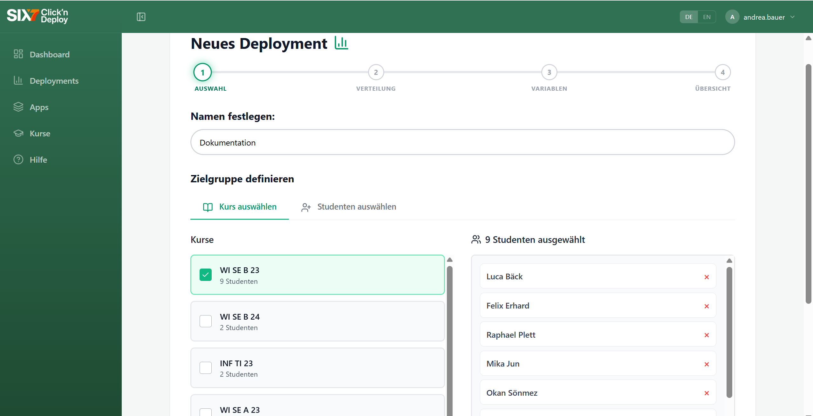
  <figcaption style="font-size: 0.9em; color: #555;">Studenten auswählen: Kurse oder Studenten hinzufügen</figcaption>
</figure>

4. Auf der Verteilungs-Seite kannst du nun die Teams bilden. Hierfür gibt es drei Möglichkeiten:
   * **Eine Gruppe:** Alle ausgewählten Studenten werden in einem einzigen Team zusammengefasst.
   * **Jeder Nutzer einzeln:** Jeder Student bildet eine eigenes Team.
   * **Individuell:** Hier kannst du auf der rechten Seite über die Plus **+** und Minus **-** Buttons eine beliebige Anzahl an Teams festlegen.

   Du kannst die Studenten über den Button **Zufall** automatisch verteilen lassen oder sie manuell per Drag-and-Drop zuweisen. Über den Button **Zurücksetzen** lässt sich die Zuteilung wieder in den Anfangszustand versetzen. Außerdem kann jedem Team auch ein individueller Name gegeben werden. Bestätige deine Eingabe mit **Weiter**.

<figure style="margin-bottom: 30px;">
  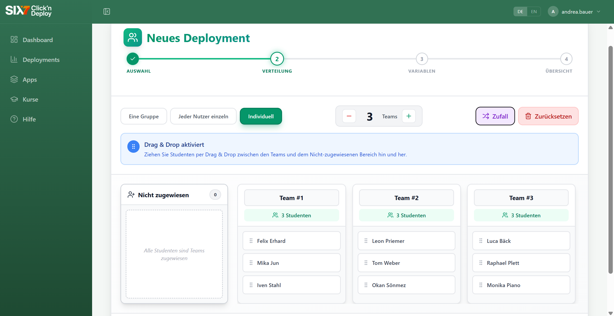
  <figcaption style="font-size: 0.9em; color: #555;">Studenten verteilen: Anzahl der Gruppen und Gruppenverteilung auswählen</figcaption>
</figure>

5. Im Schritt Variablen können nun spezifische Packer- oder Terraform-Variablen angepasst werden (abhängig von der jeweiligen App). Die Eingabefelder hängen dabei von der jeweiligen Variablen-Konfiguration ab.
   * **Standardwerte (Defaults):** Die Variablen sind bereits mit Standardwerten des App-Erstellers vorausgefüllt. 
   * **Value help:** Erfordert eine Variable eine spezifische Open-Stack Ressource (z.B. ein Netzwerk oder Flavor), nutzt das System die hinterlegten Credentials (z.B aus der clouds.yaml). Über diese Zugangsdaten werden die in OpenStack verfügbaren Ressourcen live abgerufen und als Dropdown-Menü bereitgestellt.
   * **Geltungsbereich (Scope) der Variablen:** Je nach App-Konfiguration werden Variablen in drei verschiedenen Scopes abgefragt.
     * **Alle:** Die Variable wird einmalig definiert und gilt für das gesamte Deployment.
     * **Team:** Die Variable muss für jede Gruppe separat definiert werden.
     * **User:** Die Variable muss für jeden User separat definiert werden.
   * **Info-Button:** Über das Info-Symbol (i) neben dem Variablennamen lässt sich ein Tooltip aufrufen. Dieser enthält die genaue Beschreibung der Variable und Formatierungshinweise.
   * **Datei-Uploads:** Je nach App können Dateien hochgeladen werden. Diese können per Drag-and-Drop oder per Klick eingefügt werden. Auch hier kann der Upload für alle, pro Team oder pro User erfolgen. Hierbei sollte auf die Dateiendung geachtet werden.

> **Wichtiger Hinweis (Standardwerte (Defaults)):**  Diese Defaults funktionieren nur dann fehlerfrei, wenn es Überschneidungen zwischen der Cloud-Umgebung des App-Erstellers und deinem eigenen OpenStack-Account gibt (z. B. wenn in beiden Systemen identische Bezeichnungen für Netzwerke oder Flavors existieren). Gibt es diese Überschneidungen nicht, müssen die Standardwerte zwingend an deine eigene Cloud-Umgebung angepasst werden.

> **Wichtiger Hinweis (Upload Limit):** Eine einzelne Datei darf **maximal 2MB** groß sein und das Gesamtvolumen **maximal 10MB**.

> **Wichtiger Hinweis (Web Anwendungen (z.B. pgadmin, Web-Latex)):** Wenn eine Applikation eine Web-Oberfläche bereitstellt, muss bei der Auswahl der Security Group (z.B. bei der Variable shared_secgroup_id) darauf geachtet werden, dass sie für HTTP-Zugriffe ausgelegt ist. Sie benötigt eine Eintritts-Regel für TCP auf Port 80 (HTTP) von 0.0.0.0/0. Fehlt diese Regel, sind die Web-Oberflächen nach dem Deployment nicht erreichbar.

<figure style="margin-bottom: 30px;">
  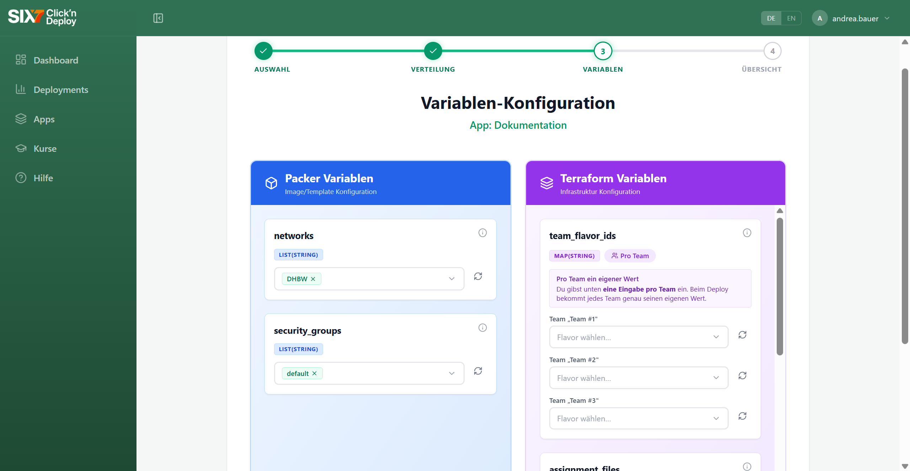
  <figcaption style="font-size: 0.9em; color: #555;">Variablen konfigurieren: Standardwerte nutzen oder konfigurieren und Dateien einfügen (abhängig von der jeweiligen App)</figcaption>
</figure>

<figure style="margin-bottom: 30px;">
  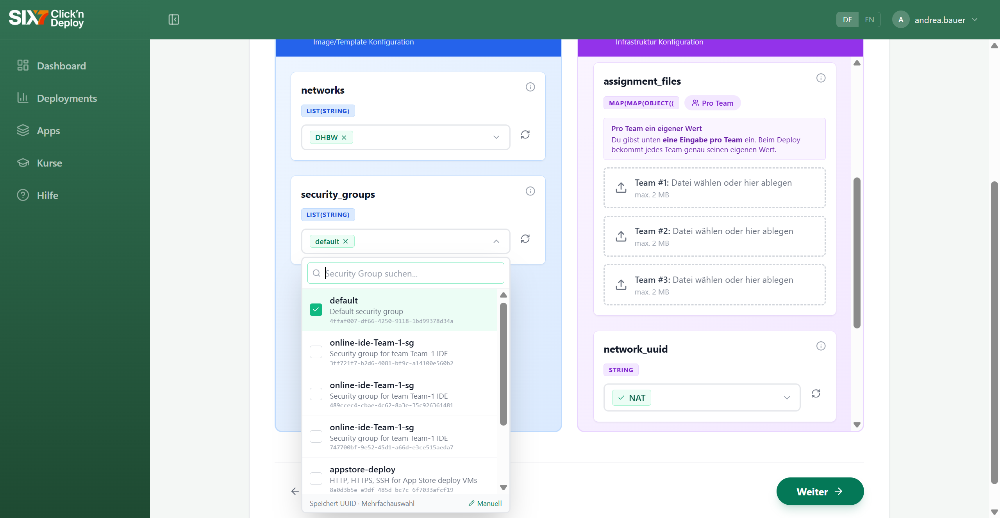
  <figcaption style="font-size: 0.9em; color: #555;">Dropdown und Dateiupload</figcaption>
</figure>

6. Den Abschluss des Deployment-Prozesses bildet die Übersichts-Seite. Hier findest du eine Zusammenfassung deiner Auswahl: Basis-Konfigurationen, Team-Zuweisung und die Variablen-Konfiguration. Falls du noch etwas anpassen möchtest, kannst du unten links über den Button **Zurück** jederzeit einen Schritt im Prozess zurückgehen. Ist alles korrekt, klicke unten rechts auf **Deployen**, um den Vorgang abzuschließen.

<figure style="margin-bottom: 30px;">
  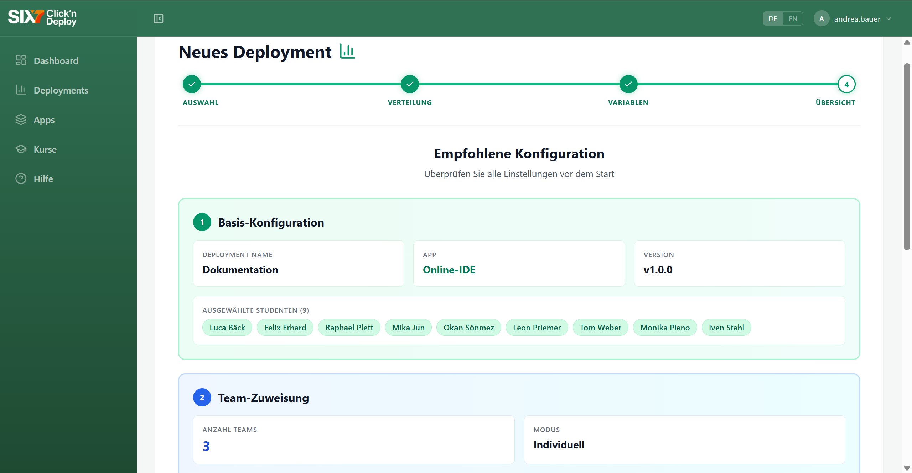
  <figcaption style="font-size: 0.9em; color: #555;">Übersicht: Zusammenfassung der Basis-Konfigurationen, Team-Zuteilung und Varianlen-Konfiguration</figcaption>
</figure>

---

### Deployments und Zugangsdaten einsehen

Durch einen Klick auf ein beliebiges Deployment in der Deployment-Übersicht gelangst du zu dessen Detailansicht. 

Oben rechts stehen dir zwei Aktionen zur Verfügung:
* **Pausieren / Fortsetzen:** Über den entsprechenden Button kannst du das gesamte Deployment vorübergehend pausieren und später wieder aktivieren.
* **Löschen:** Entfernt das Deployment unwiderruflich. Hierbei werden alle zugehörigen OpenStack-Ressourcen vollständig gelöscht.

---

#### Übersicht & Metadaten

Die Detailansicht bietet dir grundlegende Informationen zum gewählten Deployment:

* **Deployment Info:** Enthält allgemeine Daten wie den vergebenen Namen, den Release-Tag sowie das Erstellungsdatum.
* **App:** Zeigt den App-Namen, die Beschreibung und den Link zum zugehörigen Git-Repository.
* **Besitzer:** Zeigt den Nutzernamen, die E-Mail-Adresse und die Rolle der Person, die dieses Deployment gestartet hat.
* **Teams & Mitglieder:** Listet alle beteiligten Teams sowie die zugewiesenen Studierenden auf. Hier kannst du Studierenden die Zugangsdaten hier bei Bedarf erneut zusenden (**Zugang erneut senden**), sowie ihre Zugangsdaten einsehen und separat kopieren.

<figure style="margin-bottom: 30px;">
  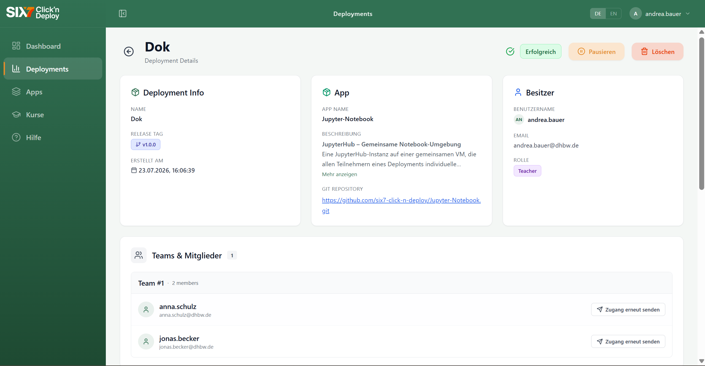
  <figcaption style="font-size: 0.9em; color: #555;">Deployments Übersicht</figcaption>
</figure>

#### Infrastruktur

In diesem Bereich verwaltest du die für das Deployment genutzten Virtuellen Maschinen (VMs) und Netzwerke:

* **Details einsehen:** Über den Button **Details** bei einer virtuellen Maschine erhältst du vertiefende Informationen zur jeweiligen Instanz.
* **Neustart (Redeploy):** Über den Button **Redeploy** kannst du eine einzelne virtuelle Maschine neu aufbauen lassen. Dabei wird ausschließlich diese spezifische Instanz zerstört und sauber neu bereitgestellt.

<figure style="margin-bottom: 30px;">
  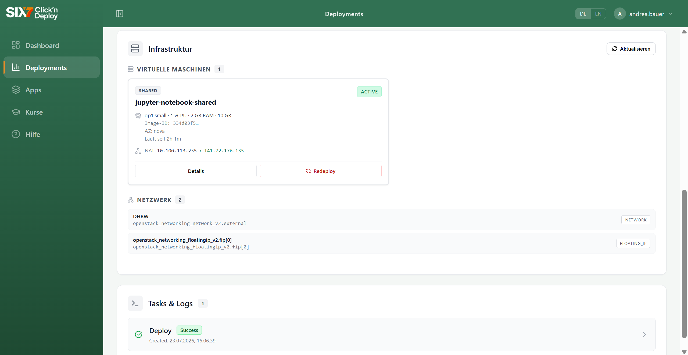
  <figcaption style="font-size: 0.9em; color: #555;">Deployments Übersicht Infrastruktur</figcaption>
</figure>

#### Tasks & Logs

Hier erhältst du transparente Einblicke in den technischen Ablauf und den aktuellen Status:

* **Task-Übersicht:** Listet alle ausgeführten Tasks mit Status, Typ sowie Start- und Endzeitstempel auf.
* **Echtzeit-Logs:** Verfolge laufende Deployments live mit. Die Logs enthalten Zeitstempel, Kategorien sowie die direkten Konsolenausgaben von Terraform und Packer. Über das Kopieren-Symbol kannst du den gesamten Log in deine Zwischenablage übernehmen.
* **Terraform-State:** In den Infrastruktur-Details findest du den rohen Terraform-State im JSON-Format (z. B. für technische Details und Output-Werte). Auch dieser lässt sich per Klick direkt in die Zwischenablage kopieren.

<figure style="margin-bottom: 30px;">
  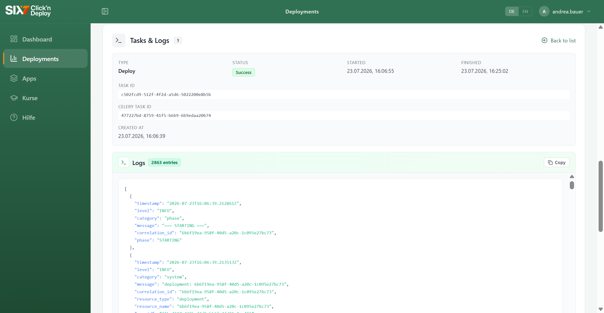
  <figcaption style="font-size: 0.9em; color: #555;">Deployments Übersicht Tasks & Logs</figcaption>
</figure>

<figure style="margin-bottom: 30px;">
  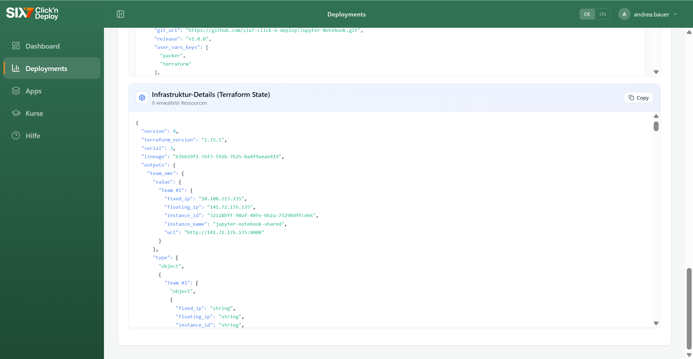
  <figcaption style="font-size: 0.9em; color: #555;">Deployments Übersicht Terraform Logs</figcaption>
</figure>

---

### Hilfe und Support

Solltest du einmal nicht weiterkommen, findest du ganz unten in der linken Seitenleiste den Punkt **Hilfe**.

Diese Seite dient als zentrale Anlaufstelle für Fragen und Probleme:
* **Wenn etwas nicht funktioniert:** Checklisten zur Fehlerbehebung (z. B. Überprüfung der Quota-Limits).
* **Schritt-für-Schritt-Anleitungen:** Erklärungen zu grundlegenden Prozessen der Plattform.
* **Nützliche Links:** Hier findest du Verlinkungen zum Projekt-Repository auf GitHub, zur technischen Dokumentation für Installation/Administration sowie Details zur Technologie-Architektur.

<figure style="margin-bottom: 30px;">
  
  <figcaption style="font-size: 0.9em; color: #555;">Hilfe & Q/A: Support, Anleitungen und weiterführende Links</figcaption>
</figure>

---

## 3. Admin

Willkommen im App Store! Diese Dokumentation führt dich durch die wichtigsten Funktionen, die dir als Admin in der Plattform zur Verfügung stehen.

---

### Login und Dashboard

Der Einstieg in die Plattform erfolgt über den regulären Login. Du kannst dich entweder mit deinem **Benutzernamen und Passwort** oder deiner **E-Mail-Adresse und Passwort** anmelden.

<figure style="margin-bottom: 30px;">
  
  <figcaption style="font-size: 0.9em; color: #555;">Keycloak Login</figcaption>
</figure>

Nach erfolgreichem Login landest du direkt auf dem **Dashboard**. Hier erhältst du einen schnellen Überblick über:
* Deine zugewiesenen Deployments und verfügbaren Apps und Kurse.
* Deine verfügbaren und genutzten OpenStack-Ressourcen (z. B. VMs, RAM, Storage, Floating IPs).

<figure style="margin-bottom: 30px;">
  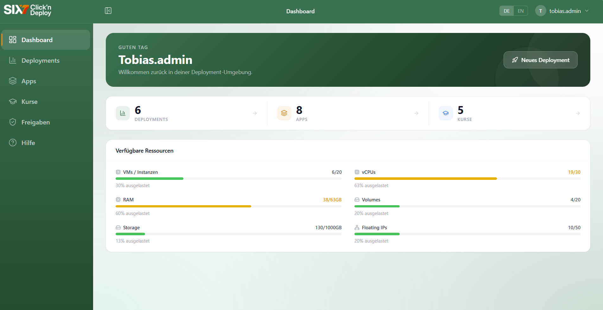
  <figcaption style="font-size: 0.9em; color: #555;">Keycloak Login</figcaption>
</figure>

**Erstanmeldung:** Wenn du dich zum ersten Mal anmeldest, fehlen dem System noch deine OpenStack-Zugangsdaten. Dies wird dir direkt oben auf dem Dashboard durch einen gelb hinterlegten Hinweis ("OpenStack-Credentials fehlen") signalisiert. Klicke dort auf den Button **Jetzt einrichten**, um deine Daten zu hinterlegen.

<figure style="margin-bottom: 30px;">
  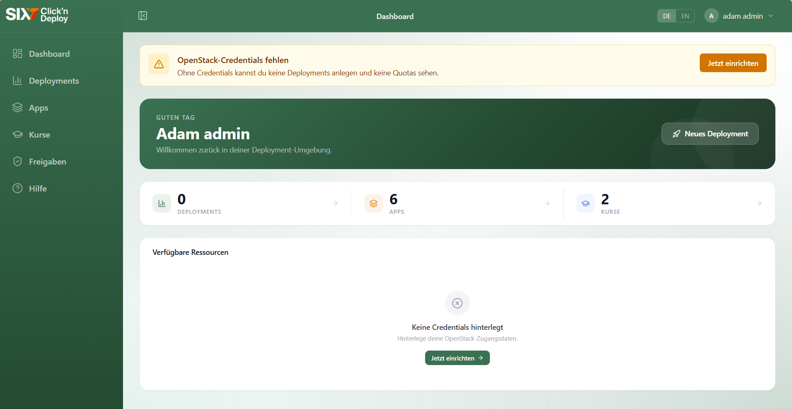
  <figcaption style="font-size: 0.9em; color: #555;">Dashboard: Hinweis auf fehlende OpenStack-Credentials</figcaption>
</figure>

---

### OpenStack-Credentials hinterlegen

Um die Ressourcen der Plattform nutzen zu können, müssen deine Credentials gültig sein. Auf der Einrichtungsseite hast du zwei Möglichkeiten:
1. **Manuelle Eingabe:** Trage die Daten (Auth-URL, Region, Username etc.) händisch in die entsprechenden Felder ein.
2. **Datei-Upload (Empfohlen):** Ziehe einfach deine `clouds.yaml`-Datei per Drag & Drop in das gestrichelte Feld oder klicke auf "Datei auswählen". Die Felder werden daraufhin automatisch ausgefüllt. Du musst lediglich noch dein persönliches Passwort eingeben.

Sobald die Daten gespeichert sind, prüft das System diese. Oben links erscheint ein grüner Status **"Credentials gültig"**. Du kannst die Verbindung jederzeit über den Button **Erneut testen** aktualisieren oder die Daten über **Löschen** komplett entfernen.

> **Ausnahmefall:** Solltest du aus der Vergangenheit bereits zugewiesene Deployments besitzen, aber keine gültigen Credentials mehr hinterlegt haben, musst du zunächst alle aktuellen Deployments löschen, bevor du neue Credentials hinzufügen kannst. 

<figure style="margin-bottom: 30px;">
  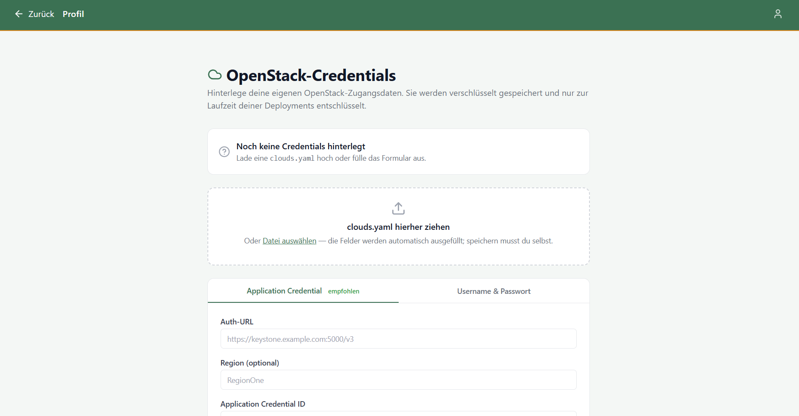
  <figcaption style="font-size: 0.9em; color: #555;">Profil-Einstellungen: Credentials hochladen oder manuell eintragen</figcaption>
</figure>

---

### Profil und Einstellungen

Klickst du oben rechts auf dein **Nutzer-Icon**, öffnet sich ein kleines Menü. Hier kannst du dich **abmelden** oder dein **Profil** aufrufen.

In der Profilansicht siehst du alle relevanten Account-Daten auf einen Blick:
* Vorname, Nachname und E-Mail-Adresse
* Deinen zugewiesenen Kurs
* Deine Rolle (Admin)
* Registrierungsdatum sowie System-IDs (Benutzer-ID und Keycloak-ID)

Zusätzlich findest du hier unter dem Punkt "Einstellungen" jederzeit den Link zu deinen **OpenStack-Credentials**, falls du diese nachträglich anpassen musst. Über den "Zurück"-Button oben links gelangst du wieder auf das Dashboard.

<figure style="margin-bottom: 30px;">
  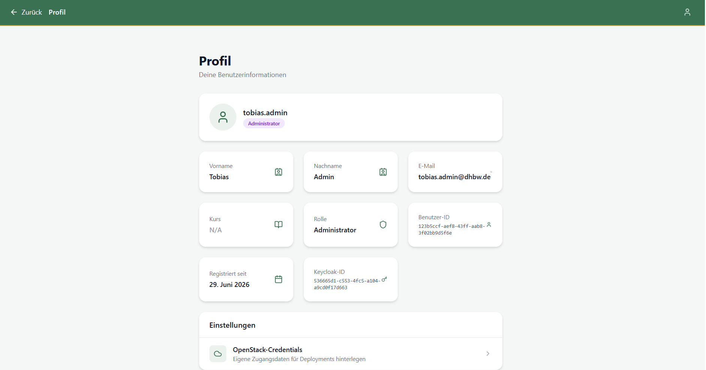
  <figcaption style="font-size: 0.9em; color: #555;">Profil: Übersicht der eigenen Benutzerdaten</figcaption>
</figure>

---

### Apps anlegen und zur Überprüfung einreichen

Über den Menüpunkt **Apps** in der linken Seitenleiste (oder den Fastlink auf dem Dashboard) gelangst du zur App-Übersicht. Als Admin kannst du neue Apps anlegen und den Prüfprozess anstoßen. 

> **Hinweis für Admins:** Auch von Admins angelegte Apps durchlaufen den regulären Review-Prozess. Das sorgt für maximale Sicherheit und ermöglicht bei Bedarf ein 4-Augen-Prinzip im Admin-Team. Du kannst deine eingereichte App im Anschluss selbst direkt freigeben.

1. Klicke in der App-Übersicht oben rechts auf den Button **+ App hinzufügen**.
2. Vergib einen **Namen** und trage eine **Beschreibung** ein (Markdown wird unterstützt, eine Live-Vorschau hilft dir bei der Formatierung).
3. (Optional) Lade ein App-Logo hoch.
4. Füge den **Link zu deinem GitHub-Repository** (als HTTPS-Link) ein.
5. **Sichtbarkeit:** Entscheide, ob die App **Privat** oder **Öffentlich** sein soll:
   - **Privat:** Nach der Freigabe ist die App nur für dich im Store sichtbar.
   - **Öffentlich:** Nach der Freigabe ist die App für alle Nutzer im Store sichtbar.
6. Falls dein GitHub-Repository privat ist, musst du vor dem Speichern den technischen User `six7-click-n-deploy` als Collaborator zum Repository hinzufügen.
7. Hake die Option **"Alle Versionen einreichen"** an, damit deine Git-Tags als Versionen für das Review übermittelt werden.

Klicke abschließend auf **Hinzufügen**. Die App wird angelegt und befindet sich nun im Status „Wartet auf Freigabe“. Als Admin kannst du die App im nächsten Schritt direkt selbst (oder durch einen anderen Admin) prüfen und genehmigen.

<figure style="margin-bottom: 30px;">
  
  <figcaption style="font-size: 0.9em; color: #555;">App hinzufügen: Einreichen einer neuen App für den Store</figcaption>
</figure>

---

### Apps-Übersicht

Über den Menüpunkt **Apps** in der linken Seitenleiste (oder den Fastlink auf dem Dashboard) gelangst du zur zentralen App-Übersicht. 

Als Admin siehst du hier **alle** bisher angelegten Apps – unabhängig davon, ob sie öffentlich oder privat sind und welcher Nutzer sie erstellt hat.

* **Filterfunktion:** Über die Tab-Felder oben rechts kannst du die Anzeige nach *Alle*, *Öffentlich* oder *Privat* filtern.
* **Kennzeichnung privater Apps:** 
  * Deine eigenen privaten Apps sind mit einem violetten Label (Privat) gekennzeichnet.
  * **Private Apps anderer Nutzer** besitzen dieses Label nicht, werden dir als Admin in der Liste aber dennoch angezeigt.

  <figure style="margin-bottom: 30px;">
  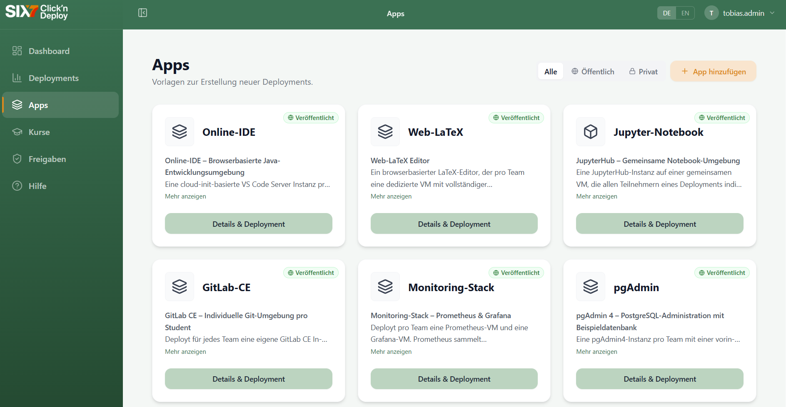
  <figcaption style="font-size: 0.9em; color: #555;">App-Übersicht (Allgemein)</figcaption>
</figure>

 <figure style="margin-bottom: 30px;">
  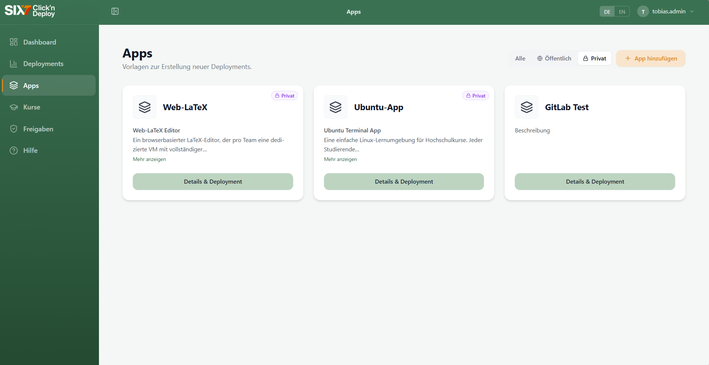
  <figcaption style="font-size: 0.9em; color: #555;">App-Übersicht: Private Apps</figcaption>
</figure>

---

### App-Details einsehen

Wenn du in der App-Übersicht auf eine der angezeigten Kacheln klickst, öffnet sich die Detailseite der jeweiligen App. Diese Seite bietet dir einen umfassenden Einblick in die Anwendung, ihre Releases sowie administrative Verwaltungsmöglichkeiten.

> **Admin-Aktionen:** In der Detailansicht findest du oben rechts jederzeit die Buttons, um die ausgewählte App zu **bearbeiten** oder vollständig zu **löschen**.

---

### Tab: Übersicht

Dieser Tab ist in verschiedene Bereiche unterteilt, die dir sowohl inhaltliche als auch technische Informationen liefern:

#### 1. Kopfbereich (Allgemeine Übersicht)
Direkt oben auf der Seite siehst du neben dem Namen und dem Logo der App auf einen Blick, **wie viele Versionen verfügbar** sind. Daneben findest du auch den direkten **Link zum dazugehörigen GitHub-Repository**.

#### 2. App-Beschreibung (Vom Entwickler definiert)
Der große Hauptbereich beinhaltet die Beschreibung der App. Diese Inhalte werden vom jeweiligen Entwickler beim Erstellen der App frei festgelegt. Hier findest du spezifische Informationen wie zum Beispiel:
* Erklärungen zu Features, dem User-Management oder dem VM-Deployment
* Schätzungen zur Deployment-Dauer
* Erklärungen zu konfigurierbaren Variablen oder benötigten Aufgabendateien

#### 3. Feste Metadaten und Versionsinfos
Im unteren Bereich der Seite befinden sich fest definierte Blöcke mit Systeminformationen:
* **App Informationen:** Zeigt an, wann und von wem (Ersteller) die App initial angelegt wurde.
* **Versionsdetails:** Liefert technische Daten zur aktuell ausgewählten Version:
  * Name & Typ
  * Commit-Hash & Autor
  * Veröffentlichungsdatum (*Published at*)
  * Pre-Release-Status
  * Link zum Release
* **Versionsbeschreibung:** Beinhaltet die spezifischen Notizen, Release Notes oder Beschreibungen, die auf GitHub für genau diese Version hinterlegt wurden.

#### 4. Versionsauswahl & Deployment
Auf der rechten Seite befindet sich eine fixierte Box zur Versionssteuerung und zum Ausführen von Aktionen:
* **Versionsauswahl:** Über das Dropdown-Menü *Version auswählen* kannst du durch alle verfügbaren Releases navigieren. Die Blöcke "Versionsdetails" und "Versionsbeschreibung" passen sich automatisch deiner Auswahl an.
* **App deployen:** Anders als reguläre Nutzer (z. B. Studenten) hast du als Admin die Berechtigung, den Deployment-Prozess zu starten. Wähle dazu einfach die gewünschte Version aus und klicke auf den Button **Jetzt Deployen**.

 <figure style="margin-bottom: 30px;">
  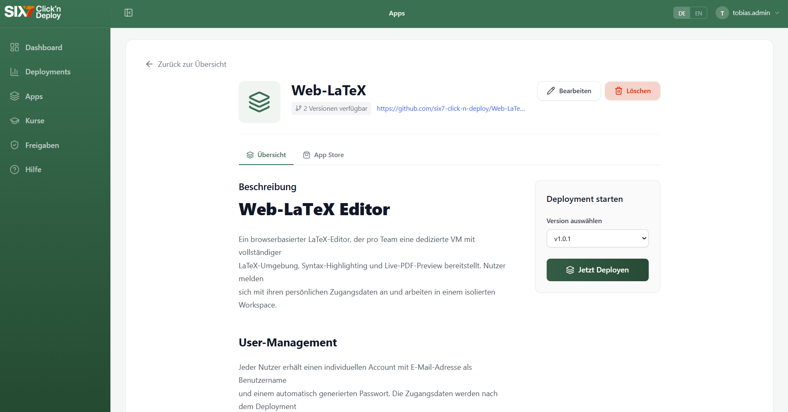
  <figcaption style="font-size: 0.9em; color: #555;">App-Details - Tab: Übersicht</figcaption>
</figure>

 

### Tab: App Store (Sichtbarkeit & Freigabe)

In diesem Tab verwaltest du die Sichtbarkeit der App im Store sowie deren Freigabe-Einstellungen:

* **Von Privat auf Öffentlich schalten:**
  Macht die App für alle Nutzer im Store sichtbar, sodass diese die App deployen können (sobald mindestens eine Version freigegeben wurde).
  
  > **Hinweis:** Bei privaten Apps *anderer Nutzer* kann nur der jeweilige Ersteller eine Version zur Freigabe einreichen.

* **Von Öffentlich auf Privat schalten:**
  Entzieht der Allgemeinheit den Zugriff auf die App.
  * **Eigene App:** Ist nach der Umstellung nur noch für dich sichtbar.
  * **App eines anderen Nutzers:** Ist nach der Umstellung nur noch für dich (als Admin) und den ursprünglichen Ersteller sichtbar.

  <figure style="margin-bottom: 30px;">
  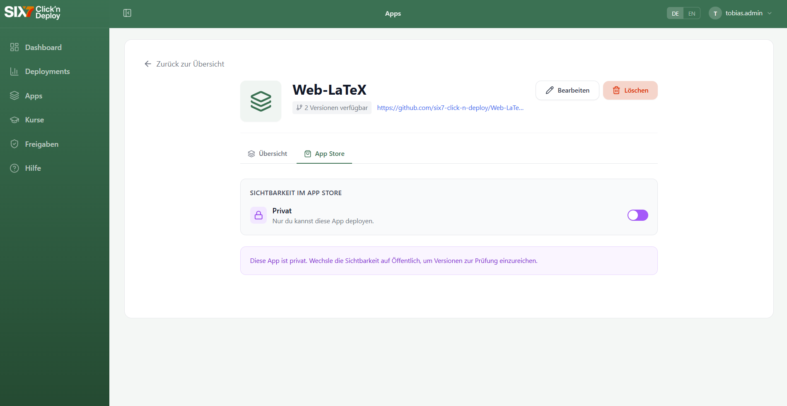
  <figcaption style="font-size: 0.9em; color: #555;">App-Details - Tab: App Store</figcaption>
</figure>

---

### Kurse verwalten

In der Kursverwaltung siehst du standardmäßig alle Kurse, die du selbst erstellt haben oder in denen du Mitglied bist.

**Neue Kurse anlegen:** Gibt es noch keine Kurse, klicke einfach auf **Kurs erstellen** oder **Ersten Kurs anlegen**. Trage im sich öffnenden Fenster den gewünschten Namen ein und bestätige mit **Erstellen**.

<figure style="margin-bottom: 30px;">
  
  <figcaption style="font-size: 0.9em; color: #555;">Kurs anlegen: Kursnamen auswählen</figcaption>
</figure>

**Mitglieder hinzufügen:** Öffne die Detailseite eines Kurses über **Details ansehen** oder direkt nach dem Erstellen. Mit einem Klick auf **Mitglied hinzufügen** öffnet sich eine Suchmaske. Hier kannst du gezielt nach E-Mail-Adressen oder Nutzernamen suchen, die gewünschten Studierenden auswählen und über **Hinzufügen** in den Kurs aufnehmen.

<figure style="margin-bottom: 30px;">
  
  <figcaption style="font-size: 0.9em; color: #555;">Kurs-Mitglieder hinzufügen: Studenten hinzufügen</figcaption>
</figure>

**Mitglieder entfernen:** Auf der Detailseite des Kurses siehst du eine Übersicht aller aktuellen Mitglieder. Rechts neben jedem Eintrag findest du die zugewiesene Rolle sowie ein Symbol, um das Mitglied aus dem Kurs zu entfernen.

<figure style="margin-bottom: 30px;">
  
  <figcaption style="font-size: 0.9em; color: #555;">Kurs-Mitglieder-Übersicht: Auflistung der Mitglieder dieses Kurses</figcaption>
</figure>

**Kursnamen bearbeiten:** Oben auf der Detailseite findest du neben dem Kursnamen ein Stift-Symbol. Klicke darauf, um den Namen zu ändern. Bestätige deine Eingabe mit dem Haken oder verwerfe die Änderung mit dem Kreuz.

**Kurse löschen:** Auf der Übersichtsseite deiner Kurse befindet sich in jeder Kachel deiner Kurse ein Mülleimer-Symbol. Klicke darauf, um diesen Kurs zu löschen und bestätige mit klick auf Löschen.

> **Wichtiger Hinweis (Kurszuweisung):** Jeder Studierende kann immer nur in *einem* Kurs sein. Fügst du jemanden hinzu, der bereits in einem anderen Kurs eingetragen ist, wird die Person automatisch in den neuen Kurs verschoben und aus dem bisherigen entfernt.

<figure style="margin-bottom: 30px;">
  
  <figcaption style="font-size: 0.9em; color: #555;">Auflistung der Kurse</figcaption>
</figure>

---
  
### Deployments

Über den Menüpunkt **Deployments** in der linken Seitenleiste findest du als Admin die Deployments **aller Nutzer**.
Die Deployments werden als Kacheln angezeigt.

<figure style="margin-bottom: 30px;">
  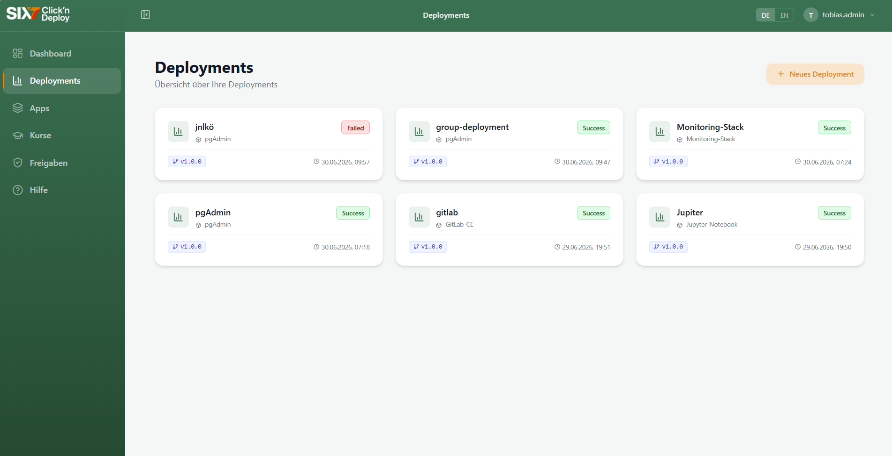
  <figcaption style="font-size: 0.9em; color: #555;">Übersicht über alle Deployments</figcaption>
</figure>

### Deployment erstellen

> **Wichtiger Hinweis (Deployment erstellen):** Um ein Deployment zu erstellen, muss im Vorfeld bereits eine App angelegt und freigegeben worden sein.

1. Klicke in der Deployment-Übersicht oben rechts auf den Button **+ Neues Deployment**. 

<figure style="margin-bottom: 30px;">
  
  <figcaption style="font-size: 0.9em; color: #555;">Deployment erstellen</figcaption>
</figure>

2. Wähle eine der bereits angelegten Apps aus, indem du auf **Details & Deployment** klickst. Auf der nun geöffneten App-Detail-Seite wählst du rechts die gewünschte Version aus und klickst auf **Jetzt Deployen**. 

<figure style="margin-bottom: 30px;">
  
  <figcaption style="font-size: 0.9em; color: #555;">Deploymentprozess: App auswählen</figcaption>
</figure>

3. Vergib einem Namen für das Deployment und füge anschließend einen kompletten Kurs oder einzelne Studenten hinzu. Auf der linken Seite findest du, je nach ausgewählter Ansicht die verfügbaren Kurse oder eine Suchfunktion. Auf der rechten Seite werden die ausgewählten Studenten aufgelistet. Über das rote Kreuz neben dem jeweiligen Namen können Personen wieder entfernt werden. Klicke auf **Weiter**, um zum nächsten Schritt zu gelangen.

<figure style="margin-bottom: 30px;">
  
  <figcaption style="font-size: 0.9em; color: #555;">Studenten auswählen: Kurse oder Studenten hinzufügen</figcaption>
</figure>

4. Auf der Verteilungs-Seite kannst du nun die Teams bilden. Hierfür gibt es drei Möglichkeiten:
   * **Eine Gruppe:** Alle ausgewählten Studenten werden in einem einzigen Team zusammengefasst.
   * **Jeder Nutzer einzeln:** Jeder Student bildet eine eigenes Team.
   * **Individuell:** Hier kannst du auf der rechten Seite über die Plus **+** und Minus **-** Buttons eine beliebige Anzahl an Teams festlegen.

   Du kannst die Studenten über den Button **Zufall** automatisch verteilen lassen oder sie manuell per Drag-and-Drop zuweisen. Über den Button **Zurücksetzen** lässt sich die Zuteilung wieder in den Anfangszustand versetzen. Außerdem kann jedem Team auch ein individueller Name gegeben werden. Bestätige deine Eingabe mit **Weiter**.

<figure style="margin-bottom: 30px;">
  
  <figcaption style="font-size: 0.9em; color: #555;">Studenten verteilen: Anzahl der Gruppen und Gruppenverteilung auswählen</figcaption>
</figure>

5. Im Schritt Variablen-Konfiguration können nun spezifische Packer- oder Terraform-Variablen angepasst werden (abhängig von der jeweiligen App). Die Eingabefelder hängen dabei von der jeweiligen Variablen-Konfiguration ab.
   * **Standardwerte (Defaults):** Die Variablen sind bereits mit Standardwerten des App-Erstellers vorausgefüllt. 
   * **Value help:** Erfordert eine Variable eine spezifische Open-Stack Ressource (z.B. ein Netzwerk oder Flavor), nutzt das System die hinterlegten Credentials (z.B aus der clouds.yaml). Über diese Zugangsdaten werden die in OpenStack verfügbaren Ressourcen live abgerufen und als Dropdown-Menü bereitgestellt.
   * **Geltungsbereich (Scope) der Variablen:** Je nach App-Konfiguration werden Variablen in drei verschiedenen Scopes abgefragt.
     * **Alle:** Die Variable wird einmalig definiert und gilt für das gesamte Deployment.
     * **Team:** Die Variable muss für jede Gruppe separat definiert werden.
     * **User:** Die Variable muss für jeden User separat definiert werden.
   * **Info-Button:** Über das Info-Symbol (i) neben dem Variablennamen lässt sich ein Tooltip aufrufen. Dieser enthält die genaue Beschreibung der Variable und Formatierungshinweise.
   * **Datei-Uploads:** Je nach App können Dateien hochgeladen werden. Diese können per Drag-and-Drop oder per Klick eingefügt werden. Auch hier kann der Upload für alle, pro Team oder pro User erfolgen. Hierbei sollte auf die Dateiendung geachtet werden.

> **Wichtiger Hinweis (Standardwerte (Defaults)):**  Diese Defaults funktionieren nur dann fehlerfrei, wenn es Überschneidungen zwischen der Cloud-Umgebung des App-Erstellers und deinem eigenen OpenStack-Account gibt (z. B. wenn in beiden Systemen identische Bezeichnungen für Netzwerke oder Flavors existieren). Gibt es diese Überschneidungen nicht, müssen die Standardwerte zwingend an deine eigene Cloud-Umgebung angepasst werden.

> **Wichtiger Hinweis (Upload Limit):** Eine einzelne Datei darf **maximal 2MB** groß sein und das Gesamtvolumen **maximal 10MB**.

> **Wichtiger Hinweis (Web Anwendungen (z.B. pgadmin, Web-Latex)):** Wenn eine Applikation eine Web-Oberfläche bereitstellt, muss bei der Auswahl der Security Group (z.B. bei der Variable shared_secgroup_id) darauf geachtet werden, dass sie für HTTP-Zugriffe ausgelegt ist. Sie benötigt eine Eintritts-Regel für TCP auf Port 80 (HTTP) von 0.0.0.0/0. Fehlt diese Regel, sind die Web-Oberflächen nach dem Deployment nicht erreichbar.

<figure style="margin-bottom: 30px;">
  
  <figcaption style="font-size: 0.9em; color: #555;">Variablen konfigurieren: Standardwerte nutzen oder konfigurieren und Dateien einfügen (abhängig von der jeweiligen App)</figcaption>
</figure>

<figure style="margin-bottom: 30px;">
  
  <figcaption style="font-size: 0.9em; color: #555;">Dropdown und Dateiupload</figcaption>
</figure>

6. Den Abschluss des Deployment-Prozesses bildet die Übersichts-Seite. Hier findest du eine Zusammenfassung deiner Auswahl: Basis-Konfigurationen, Team-Zuweisung und die Variablen-Konfiguration. Falls du noch etwas anpassen möchtest, kannst du unten links über den Button **Zurück** jederzeit einen Schritt im Prozess zurückgehen. Ist alles korrekt, klicke unten rechts auf **Deployen**, um den Vorgang abzuschließen.

<figure style="margin-bottom: 30px;">
  
  <figcaption style="font-size: 0.9em; color: #555;">Übersicht: Zusammenfassung der Basis-Konfigurationen, Team-Zuteilung und Varianlen-Konfiguration</figcaption>
</figure>

### Deployments und Zugangsdaten einsehen

Durch einen Klick auf ein beliebiges Deployment in der Deployment-Übersicht gelangst du zu dessen Detailansicht. 

Oben rechts stehen dir zwei administrative Aktionen zur Verfügung:
* **Pausieren / Fortsetzen:** Über den entsprechenden Button kannst du das gesamte Deployment vorübergehend pausieren und später wieder aktivieren.
* **Löschen:** Entfernt das Deployment unwiderruflich. Hierbei werden alle zugehörigen OpenStack-Ressourcen vollständig gelöscht.

> **Hinweis:** Das Ausführen von Aktionen auf dieser Seite (wie z. B. das Pausieren, Löschen oder der Neustart/Redeploy einzelner VMs) ist nur möglich, wenn die in deinem Admin-Konto hinterlegten OpenStack-Credentials die entsprechenden Berechtigungen aufweisen. Fehlen diese Rechte, werden die jeweiligen Befehle vom System abgelehnt.

---

#### Übersicht & Metadaten

Die Detailansicht bietet dir grundlegende Informationen zum gewählten Deployment:

* **Deployment Info:** Enthält allgemeine Daten wie den vergebenen Namen, den Release-Tag sowie das Erstellungsdatum.
* **App:** Zeigt den App-Namen, die Beschreibung und den Link zum zugehörigen Git-Repository.
* **Besitzer:** Zeigt den Nutzernamen, die E-Mail-Adresse und die Rolle der Person, die dieses Deployment gestartet hat.
* **Teams & Mitglieder:** Listet alle beteiligten Teams sowie die zugewiesenen Studierenden auf. Hier kannst du Studierenden die Zugangsdaten hier bei Bedarf erneut zusenden (**Zugang erneut senden**), sowie ihre Zugangsdaten einsehen und separat kopieren.

<figure style="margin-bottom: 30px;">
  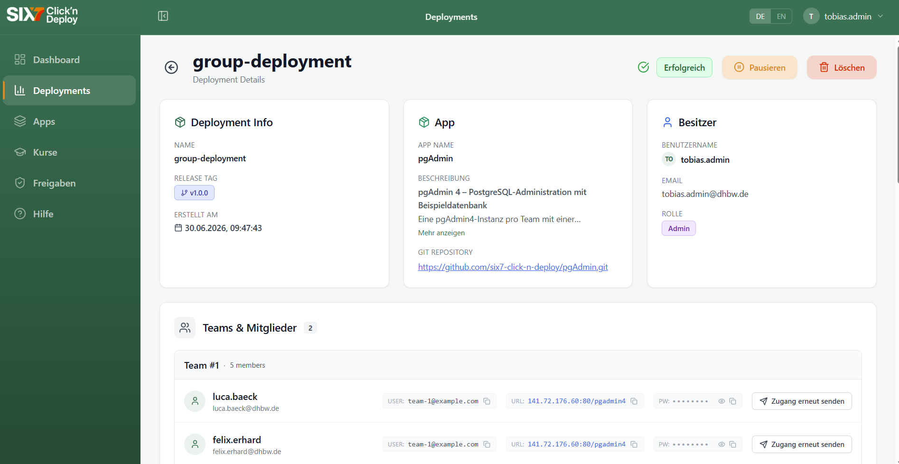
  <figcaption style="font-size: 0.9em; color: #555;">Deployment-Übersicht: Allgemeine Details und Teaminformationen</figcaption>
</figure>

---

#### Infrastruktur

In diesem Bereich verwaltest du die für das Deployment genutzten Virtuellen Maschinen (VMs) und Netzwerke:

* **Details einsehen:** Über den Button **Details** bei einer virtuellen Maschine erhältst du vertiefende Informationen zur jeweiligen Instanz.
* **Neustart (Redeploy):** Über den Button **Redeploy** kannst du eine einzelne virtuelle Maschine neu aufbauen lassen. Dabei wird ausschließlich diese spezifische Instanz zerstört und sauber neu bereitgestellt.

<figure style="margin-bottom: 30px;">
  
  <figcaption style="font-size: 0.9em; color: #555;">Deployment-Übersicht: Infrastruktur und Instanzen</figcaption>
</figure>

---

#### Tasks & Logs

Hier erhältst du transparente Einblicke in den technischen Ablauf und den aktuellen Status:

* **Task-Übersicht:** Listet alle ausgeführten Tasks mit Status, Typ sowie Start- und Endzeitstempel auf.
* **Echtzeit-Logs:** Verfolge laufende Deployments live mit. Die Logs enthalten Zeitstempel, Kategorien sowie die direkten Konsolenausgaben von Terraform und Packer. Über das Kopieren-Symbol kannst du den gesamten Log in deine Zwischenablage übernehmen.
* **Terraform-State:** In den Infrastruktur-Details findest du den rohen Terraform-State im JSON-Format (z. B. für technische Details und Output-Werte). Auch dieser lässt sich per Klick direkt in die Zwischenablage kopieren.

<figure style="margin-bottom: 30px;">
  
  <figcaption style="font-size: 0.9em; color: #555;">Deployment-Übersicht: Tasks und Live-Logs</figcaption>
</figure>

<figure style="margin-bottom: 30px;">
  
  <figcaption style="font-size: 0.9em; color: #555;">Deployment-Übersicht: Terraform State (JSON)</figcaption>
</figure>

### App-Freigaben verwalten

Als Admin verfügst du über erweiterte Rechte, um neue App-Versionen zu prüfen, freizugeben oder zu sperren. 

### Die Freigabe-Verwaltung im Überblick

Über den Menüpunkt **Apps** in der linken Seitenleiste gelangst du zur Freigabe-Verwaltung. Hier siehst du standardmäßig nur Apps, für die aktuell eine Freigabe beantragt wurde. 

* **Neue Versionen prüfen:** Liegen ausstehende Einreichungen vor, werden diese hier aufgelistet. Du kannst jede Version entweder **genehmigen** oder **ablehnen**.
* **Filter ausschalten (Alle Apps anzeigen):** Wenn du oben rechts den Filter deaktivierst, siehst du alle öffentlichen und privaten Apps. 
* **Hinweis zu privaten Apps:** Hier werden keine ausstehenden Freigaben angezeigt. Erst wenn eine App veröffentlicht wird, können Versionen zur Freigabe eingereicht werden.
* **Detailansicht:** Klicke auf eine App in der Liste, um alle eingereichten Versionen und deren aktuellen Status einzusehen.

<figure style="margin-bottom: 30px;">
  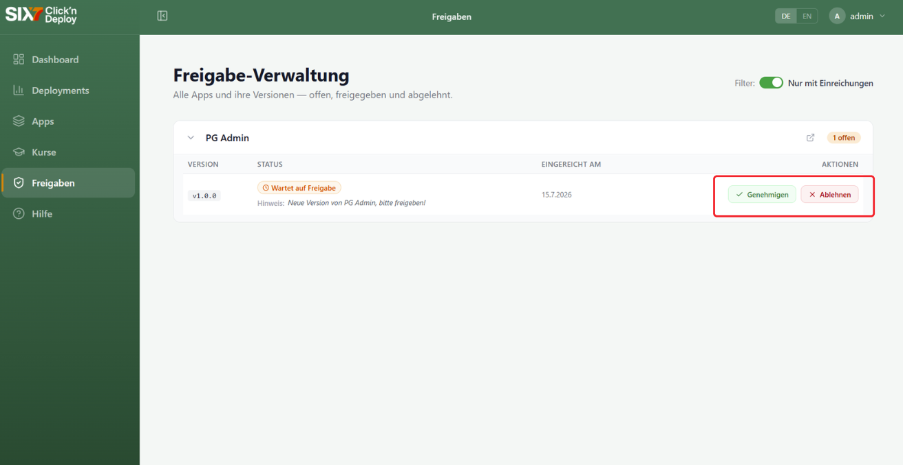
  <figcaption style="font-size: 0.9em; color: #555;">Freigabe-Verwaltung: Übersicht der ausstehenden App-Freigaben</figcaption>
</figure>

<figure style="margin-bottom: 30px;">
  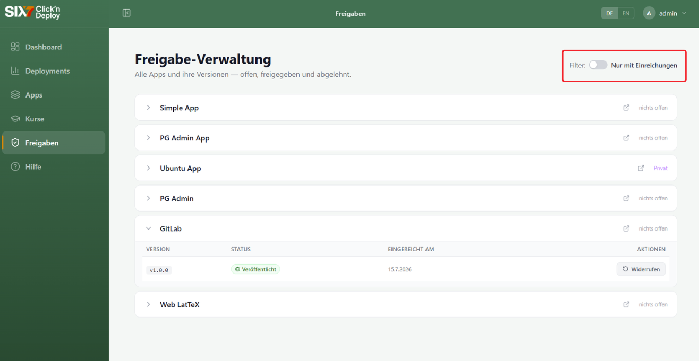
  <figcaption style="font-size: 0.9em; color: #555;">Freigabe-Verwaltung: Deaktivierter Filter</figcaption>
</figure>

---

### App-Versionen freigeben oder ablehnen

Du hast drei Möglichkeiten, wie du mit eingereichten oder bereits freigegebenen Versionen verfahren kannst:

| Aktion | Ablauf & Voraussetzungen | Auswirkung |
| :--- | :--- | :--- |
| **Genehmigen** | Klicke bei der ausstehenden Version auf **Genehmigen**. | Die Version wird sofort für alle Nutzer freigeschaltet. |
| **Ablehnen** | Klicke auf "Ablehnen".  **Pflicht:** Du musst im Freitextfeld einen Ablehnungsgrund angeben. | Die Version wird nicht freigeschaltet. Der zugehörige Nutzer sieht deine Begründung. |
| **Widerrufen** | Du kannst eine bereits genehmigte Version durch Klick auf "Widerrufen" jederzeit nachträglich sperren. **Pflicht:** Du musst einen Widerrufsgrund (z. B. eine Sicherheitslücke) angeben. | Die Version wird für alle Nutzer sofort gesperrt. |

<figure style="margin-bottom: 30px;">
  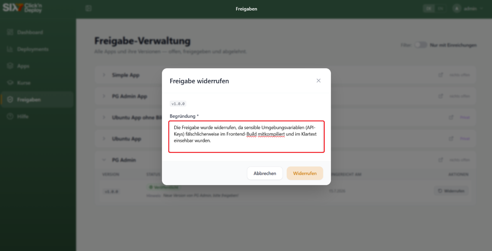
  <figcaption style="font-size: 0.9em; color: #555;">Freigabe-Verwaltung: Freigabe widerrufen</figcaption>
</figure>

> **Gut zu wissen:** Sowohl abgelehnte als auch widerrufene Versionen sind nicht endgültig verloren. Du kannst diese zu einem späteren Zeitpunkt jederzeit manuell **erneut genehmigen**, sobald die Probleme behoben wurden.

### Hilfe und Support

Solltest du einmal nicht weiterkommen, findest du ganz unten in der linken Seitenleiste den Punkt **Hilfe**.

Diese Seite dient als zentrale Anlaufstelle für Fragen und Probleme:
* **Wenn etwas nicht funktioniert:** Checklisten zur Fehlerbehebung (z. B. Überprüfung der Quota-Limits).
* **Schritt-für-Schritt-Anleitungen:** Erklärungen zu grundlegenden Prozessen der Plattform.
* **Nützliche Links:** Hier findest du Verlinkungen zum Projekt-Repository auf GitHub, zur technischen Dokumentation für Installation/Administration sowie Details zur Technologie-Architektur.

<figure style="margin-bottom: 30px;">
  
  <figcaption style="font-size: 0.9em; color: #555;">Hilfe & Q/A: Support, Anleitungen und weiterführende Links</figcaption>
</figure>

---