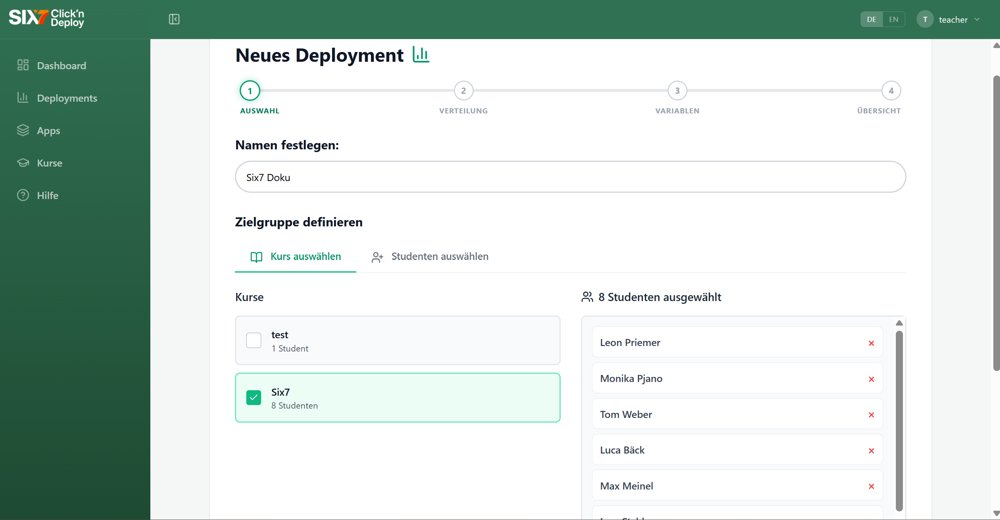
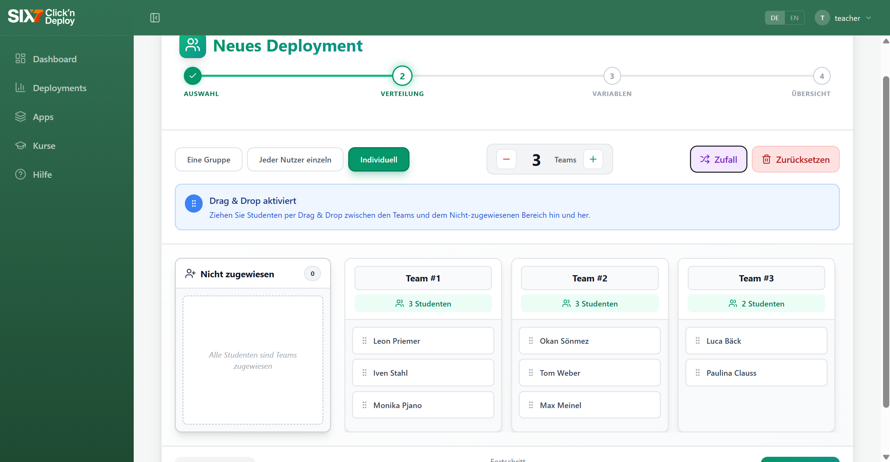
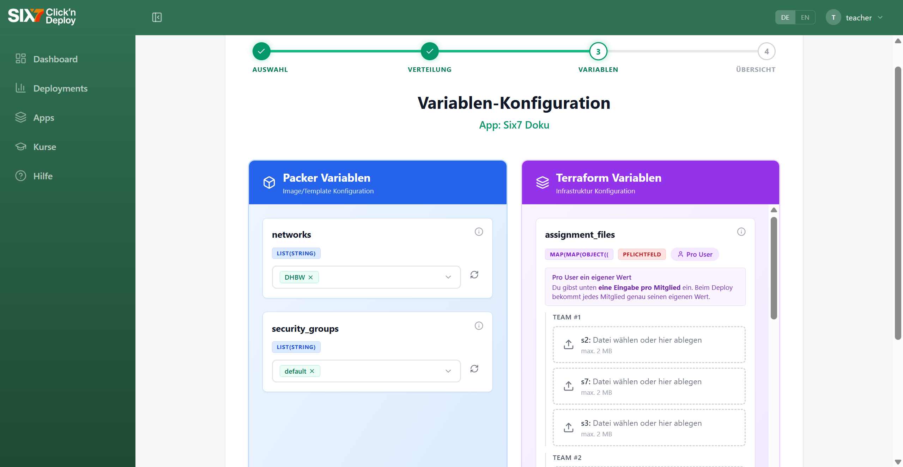
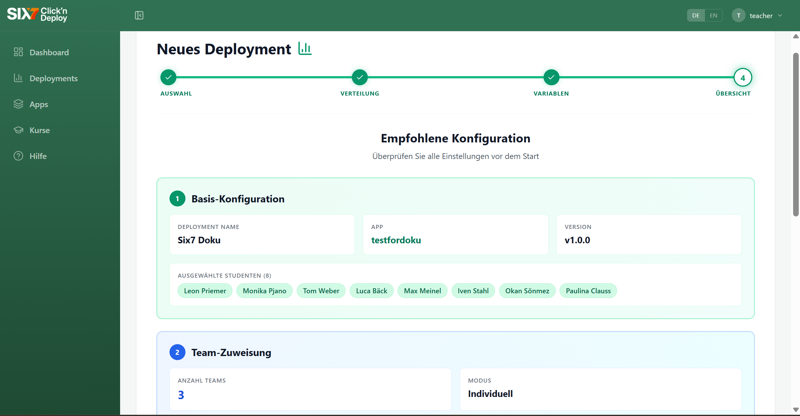

# Endnutzer Dokumentation

### Autoren
1. **Tom Weber** *(Dokumentationsteil: Student)*
2. **Paulina Clauss** *(Dokumentationsteil: Lehrender)*
3. **Monika Piano** *(Dokumentationsteil: Admin)*

### Reviewer (Prüfer)
1. **[Name Reviewer 1]**
2. **[Name Reviewer 2]** 

---

## 1. Studenten

Willkommen im App Store! Diese Dokumentation führt dich durch die wichtigsten Funktionen, die dir als Student in der Plattform zur Verfügung stehen.

### Login und Dashboard

Der Einstieg in die Plattform erfolgt über den regulären Login. Du kannst dich entweder mit deinem **Benutzernamen und Passwort** oder deiner **E-Mail-Adresse und Passwort** anmelden.

Nach erfolgreichem Login landest du direkt auf dem **Dashboard**. Hier erhältst du einen schnellen Überblick über:
* Deine zugewiesenen Deployments und verfügbaren Apps.
* Deine verfügbaren und genutzten OpenStack-Ressourcen (z. B. VMs, RAM, Storage, Floating IPs).

**Erstanmeldung:** Wenn du dich zum ersten Mal anmeldest, fehlen dem System noch deine OpenStack-Zugangsdaten. Dies wird dir direkt oben auf dem Dashboard durch einen gelb hinterlegten Hinweis ("OpenStack-Credentials fehlen") signalisiert. Klicke dort auf den Button **Jetzt einrichten**, um deine Daten zu hinterlegen.

<figure style="margin-bottom: 30px;">
  
  <figcaption style="font-size: 0.9em; color: #555;">Dashboard: Hinweis auf fehlende OpenStack-Credentials</figcaption>
</figure>

### OpenStack-Credentials hinterlegen

Um die Ressourcen der Plattform nutzen zu können, müssen deine Credentials gültig sein. Auf der Einrichtungsseite hast du zwei Möglichkeiten:
1. **Manuelle Eingabe:** Trage die Daten (Auth-URL, Region, Username etc.) händisch in die entsprechenden Felder ein.
2. **Datei-Upload (Empfohlen):** Ziehe einfach deine `clouds.yaml`-Datei per Drag & Drop in das gestrichelte Feld oder klicke auf "Datei auswählen". Die Felder werden daraufhin automatisch ausgefüllt. Du musst lediglich noch dein persönliches Passwort eingeben.

Sobald die Daten gespeichert sind, prüft das System diese. Oben links erscheint ein grüner Status **"Credentials gültig"**. Du kannst die Verbindung jederzeit über den Button **Erneut testen** aktualisieren oder die Daten über **Löschen** komplett entfernen.

> **Ausnahmefall:** Solltest du aus der Vergangenheit bereits zugewiesene Deployments besitzen, aber keine gültigen Credentials mehr hinterlegt haben, musst du zunächst alle aktuellen Deployments löschen, bevor du neue Credentials hinzufügen kannst. In diesem (seltenen) Fall erscheint ein blauer Hinweiskasten mit weiteren Instruktionen.

<figure style="margin-bottom: 30px;">
  
  <figcaption style="font-size: 0.9em; color: #555;">Profil-Einstellungen: Credentials hochladen oder manuell eintragen</figcaption>
</figure>

### Profil und Einstellungen

Klickst du oben rechts auf dein **Nutzer-Icon**, öffnet sich ein kleines Menü. Hier kannst du dich **abmelden** oder dein **Profil** aufrufen.

In der Profilansicht siehst du alle relevanten Account-Daten auf einen Blick:
* Vorname, Nachname und E-Mail-Adresse
* Deinen zugewiesenen Kurs
* Deine Rolle (Student)
* Registrierungsdatum sowie System-IDs (Benutzer-ID und Keycloak-ID)

Zusätzlich findest du hier unter dem Punkt "Einstellungen" jederzeit den Link zu deinen **OpenStack-Credentials**, falls du diese nachträglich anpassen musst. Über den "Zurück"-Button oben links gelangst du wieder auf das Dashboard.

<figure style="margin-bottom: 30px;">
  
  <figcaption style="font-size: 0.9em; color: #555;">Profil: Übersicht der eigenen Benutzerdaten</figcaption>
</figure>

### Apps anlegen und einreichen

Über den Menüpunkt **Apps** in der linken Seitenleiste (oder den Fastlink auf dem Dashboard) gelangst du zur App-Übersicht. Als Student hast du die Möglichkeit, neue Apps zur Überprüfung vorzuschlagen.

1. Klicke in der App-Übersicht oben rechts auf den Button **+ App hinzufügen**.
2. Vergib einen **Namen** und trage eine **Beschreibung** ein (Markdown wird hierbei unterstützt, eine Live-Vorschau hilft dir bei der Formatierung).
3. (Optional) Lade ein App-Logo hoch.
4. Füge den **Link zu deinem GitHub-Repository** (als HTTPS-Link) ein.
5. **Sichtbarkeit:** Als Student hast du *nicht* die Berechtigung, Apps "Privat" zu halten und selbst zu deployen. Die Sichtbarkeit muss auf **Öffentlich** gestellt werden. Das bedeutet, die App wird nach einer Prüfung für alle Nutzer im Store sichtbar.
6. Hake die Option **"Alle Versionen einreichen"** an, damit deine Git-Tags als Versionen an einen Admin zur Überprüfung (Review) gesendet werden.

> **Wichtiger Hinweis (GitHub Collaborator):** Bevor du die App speicherst, musst du zwingend den technischen User `six7-click-n-deploy` als Collaborator zu deinem eigenen GitHub-Repository hinzufügen. Dies wird dir auch in einem blauen Infokasten auf der Seite angezeigt.

Klicke abschließend auf **Hinzufügen**. Die App taucht nun in der Übersicht auf und wartet auf die Freigabe durch einen Administrator.

<figure style="margin-bottom: 30px;">
  
  <figcaption style="font-size: 0.9em; color: #555;">App hinzufügen: Einreichen einer neuen App für den Store</figcaption>
</figure>

### Deployments und Zugangsdaten einsehen

**Wichtig:** Als Student kannst du *keine* eigenen Deployments starten oder konfigurieren. Diese Aufgabe übernehmen Lehrkräfte oder Admins für dich.

Du kannst jedoch über den Menüpunkt **Deployments** in der linken Seitenleiste alle Deployments einsehen, denen du (bzw. dein Team) zugewiesen wurdest.

* **Übersicht:** Hier siehst du eine Liste der aktiven Deployments inklusive Status (z. B. "Erfolgreich").
* **Details & Zugangsdaten:** Klicke auf ein Deployment, um die Details zu öffnen. Du siehst Informationen zur genutzten App, dem Besitzer (Lehrkraft/Admin) und der Team-Zuteilung.
* **Zugang erneut senden:** In der Sektion "Teams & Mitglieder" findest du neben deinem Namen den Button **Zugang erneut senden**. Solltest du deine Logindaten für diese spezifische App (z. B. Benutzername und Passwort für eine Datenbank-Instanz) vergessen oder nicht erhalten haben, kannst du sie dir hierüber erneut zuschicken lassen.

<figure style="margin-bottom: 30px;">
  
  <figcaption style="font-size: 0.9em; color: #555;">Deployments: Details einsehen und Logindaten erneut anfordern</figcaption>
</figure>

---

### Hilfe und Support

Solltest du einmal nicht weiterkommen, findest du ganz unten in der linken Seitenleiste den Punkt **Hilfe**.

Diese Seite dient als zentrale Anlaufstelle für Fragen und Probleme:
* **Wenn etwas nicht funktioniert:** Checklisten zur Fehlerbehebung (z. B. Überprüfung der Quota-Limits).
* **Schritt-für-Schritt-Anleitungen:** Erklärungen zu grundlegenden Prozessen der Plattform.
* **Nützliche Links:** Hier findest du Verlinkungen zum Projekt-Repository auf GitHub, zur technischen Dokumentation für Installation/Administration sowie Details zur Technologie-Architektur.

<figure style="margin-bottom: 30px;">
  
  <figcaption style="font-size: 0.9em; color: #555;">Hilfe & Q/A: Support, Anleitungen und weiterführende Links</figcaption>
</figure>

---

## 2. Lehrender

Willkommen im App Store! Diese Dokumentation führt dich durch die wichtigsten Funktionen, die dir als Lehrender in der Plattform zur Verfügung stehen.

### Login und Dashboard

Der Einstieg in die Plattform erfolgt über den regulären Login. Du kannst dich entweder mit deinem **Benutzernamen und Passwort** oder deiner **E-Mail-Adresse und Passwort** anmelden.

Nach erfolgreichem Login landest du direkt auf dem **Dashboard**. Hier erhältst du einen schnellen Überblick über:
* Deine zugewiesenen Deployments und verfügbaren Apps.
* Deine verfügbaren und genutzten OpenStack-Ressourcen (z. B. VMs, RAM, Storage, Floating IPs).

**Erstanmeldung:** Wenn du dich zum ersten Mal anmeldest, fehlen dem System noch deine OpenStack-Zugangsdaten. Dies wird dir direkt oben auf dem Dashboard durch einen gelb hinterlegten Hinweis ("OpenStack-Credentials fehlen") signalisiert. Klicke dort auf den Button **Jetzt einrichten**, um deine Daten zu hinterlegen.

<figure style="margin-bottom: 30px;">
  
  <figcaption style="font-size: 0.9em; color: #555;">Dashboard: Hinweis auf fehlende OpenStack-Credentials</figcaption>
</figure>

### OpenStack-Credentials hinterlegen

Um die Ressourcen der Plattform nutzen zu können, müssen deine Credentials gültig sein. Auf der Einrichtungsseite hast du zwei Möglichkeiten:
1. **Manuelle Eingabe:** Trage die Daten (Auth-URL, Region, Username etc.) händisch in die entsprechenden Felder ein.
2. **Datei-Upload (Empfohlen):** Ziehe einfach deine `clouds.yaml`-Datei per Drag & Drop in das gestrichelte Feld oder klicke auf "Datei auswählen". Die Felder werden daraufhin automatisch ausgefüllt. Du musst lediglich noch dein persönliches Passwort eingeben.

Sobald die Daten gespeichert sind, prüft das System diese. Oben links erscheint ein grüner Status **"Credentials gültig"**. Du kannst die Verbindung jederzeit über den Button **Erneut testen** aktualisieren oder die Daten über **Löschen** komplett entfernen.

> **Ausnahmefall:** Solltest du aus der Vergangenheit bereits zugewiesene Deployments besitzen, aber keine gültigen Credentials mehr hinterlegt haben, musst du zunächst alle aktuellen Deployments löschen, bevor du neue Credentials hinzufügen kannst. In diesem (seltenen) Fall erscheint ein blauer Hinweiskasten mit weiteren Instruktionen.

<figure style="margin-bottom: 30px;">
  
  <figcaption style="font-size: 0.9em; color: #555;">Profil-Einstellungen: Credentials hochladen oder manuell eintragen</figcaption>
</figure>

### Profil und Einstellungen

Klickst du oben rechts auf dein **Nutzer-Icon**, öffnet sich ein kleines Menü. Hier kannst du dich **abmelden** oder dein **Profil** aufrufen.

In der Profilansicht siehst du alle relevanten Account-Daten auf einen Blick:
* Vorname, Nachname und E-Mail-Adresse
* Deinen zugewiesenen Kurs
* Deine Rolle (Lehrender)
* Registrierungsdatum sowie System-IDs (Benutzer-ID und Keycloak-ID)

Zusätzlich findest du hier unter dem Punkt "Einstellungen" jederzeit den Link zu deinen **OpenStack-Credentials**, falls du diese nachträglich anpassen musst. Über den "Zurück"-Button oben links gelangst du wieder auf das Dashboard.

<figure style="margin-bottom: 30px;">
  
  <figcaption style="font-size: 0.9em; color: #555;">Profil: Übersicht der eigenen Benutzerdaten</figcaption>
</figure>

### Apps anlegen und einreichen

Über den Menüpunkt **Apps** in der linken Seitenleiste (oder den Fastlink auf dem Dashboard) gelangst du zur App-Übersicht. Als Lehrender hast du die Möglichkeit, neue Apps zur Überprüfung vorzuschlagen.

1. Klicke in der App-Übersicht oben rechts auf den Button **+ App hinzufügen**.
2. Vergib einen **Namen** und trage eine **Beschreibung** ein (Markdown wird hierbei unterstützt, eine Live-Vorschau hilft dir bei der Formatierung).
3. (Optional) Lade ein App-Logo hoch.
4. Füge den **Link zu deinem GitHub-Repository** (als HTTPS-Link) ein.
5. **Sichtbarkeit:** Als Lehrender kannst du entscheiden, ob du die App **Privat** oder **Öffentlich** halten möchtest. Privat bedeutet hierbei, dass die App nach einer Prüfung nur für dich im Store sichtbar ist. Öffentlich bedeutet, dass die App nach einer Prüfung für alle Nutzer im Store sichtbar wird.
6. Hake die Option **"Alle Versionen einreichen"** an, damit deine Git-Tags als Versionen an einen Admin zur Überprüfung (Review) gesendet werden.

> **Wichtiger Hinweis (GitHub Collaborator):** Bevor du die App speicherst, musst du zwingend den technischen User `six7-click-n-deploy` als Collaborator zu deinem eigenen GitHub-Repository hinzufügen. Dies wird dir auch in einem blauen Infokasten auf der Seite angezeigt.

Klicke abschließend auf **Hinzufügen**. Die App taucht nun in der Übersicht auf und wartet auf die Freigabe durch einen Administrator.

<figure style="margin-bottom: 30px;">
  
  <figcaption style="font-size: 0.9em; color: #555;">App hinzufügen: Einreichen einer neuen App für den Store</figcaption>
</figure>

### Kurse verwalten

In der Kursverwaltung siehst du standardmäßig alle Kurse, die du selbst erstellt haben oder in denen du Mitglied bist.

* **Neue Kurse anlegen:** Gibt es noch keine Kurse, klicke einfach auf **Kurs erstellen** oder **Ersten Kurs anlegen**. Trage im sich öffnenden Fenster den gewünschten Namen ein und bestätige mit **Erstellen**.
* **Mitglieder hinzufügen:** Öffne die Detailseite eines Kurses über **Details ansehen** oder direkt nach dem Erstellen. Mit einem Klick auf **Mitglied hinzufügen** öffnet sich eine Suchmaske. Hier kannst du gezielt nach E-Mail-Adressen oder Nutzernamen suchen, die gewünschten Studierenden auswählen und über **Hinzufügen** in den Kurs aufnehmen.
* **Mitglieder entfernen:** Auf der Detailseite des Kurses siehst du eine Übersicht aller aktuellen Mitglieder. Rechts neben jedem Eintrag findest du die zugewiesene Rolle sowie ein Symbol, um das Mitglied aus dem Kurs zu entfernen.
* **Kursnamen bearbeiten:** Oben auf der Detailseite findest du neben dem Kursnamen ein Stift-Symbol. Klicke darauf, um den Namen zu ändern. Bestätige deine Eingabe mit dem Haken oder verwerfe die Änderung mit dem Kreuz.
* **Kurse löschen:** Auf der Übersichtsseite deiner Kurse befindet sich in jeder Kachel deiner Kurse ein Mülleimer-Symbol. Klicke darauf, um diesen Kurs zu löschen und bestätige mit klick auf Löschen.

> **Wichtiger Hinweis (Kurszuweisung):** Jeder Studierende kann immer nur in *einem* Kurs sein. Fügst du jemanden hinzu, der bereits in einem anderen Kurs eingetragen ist, wird die Person automatisch in den neuen Kurs verschoben und aus dem bisherigen entfernt.

> **Wichtiger Hinweis (Suchfunktion):** In der Suche tauchen nur Studierende auf, die im System (Keycloak) mit der entsprechenden Rolle hinterlegt sind und sich bereits mindestens einmal eingeloggt haben.

<figure style="margin-bottom: 30px;">
  
  <figcaption style="font-size: 0.9em; color: #555;">Kurs anlegen: Kursnamen auswählen</figcaption>
</figure>

<figure style="margin-bottom: 30px;">
  
  <figcaption style="font-size: 0.9em; color: #555;">Kurs-Mitglieder-Übersicht: Auflistung der Mitglieder dieses Kurses</figcaption>
</figure>

<figure style="margin-bottom: 30px;">
  
  <figcaption style="font-size: 0.9em; color: #555;">Kurs-Mitglieder hinzufügen: Studenten hinzufügen</figcaption>
</figure>

### Deployments hinzufügen

Über den Menüpunkt **Deployments** in der linken Seitenleiste findest du alle Deployments, die du erstellt hast.

> **Wichtiger Hinweis (Deployment hinzufügen):** Um ein Deployment hinzuzufügen, muss im Vorgeld bereits eine App angelegt und freigegeben worden sein.

1. Klicke in der Deployment-Übersicht oben rechts auf den Button **+ Neues Deployment**. 
2. Wähle eine deiner bereits angelegten Apps aus, indem du auf **Details & Deployment** klickst. Auf der nun geöffneten App-Detail-Seite wählst du rechts die gewünschte Version aus und klickst auf **Jetzt Deployen**. 
3. Vergib einem Namen für das Deployment und füge anschließend einen kompletten Kurs oder einzelne Studenten hinzu. Auf der Linken Seite findest du, je nach ausgewählter Ansicht die verfügbaren Kurse oder eine Suchfunktion. Auf der rechten Seite werden die ausgewählten Studenten aufgelistet. Über das rote Kreuz neben dem jeweiligen Namen können Personen wieder entfernt werden. Klicke auf **Weiter**, um zum nächsten Schritt zu gelangen.
4. Auf der Verteilungs-Seite kannst du nun die Gruppen bilden. Hierfür gibt es drei Möglichkeiten:
  * **Eine Gruppe:** Alle ausgewählten Studenten werden in einer einzigen Gruppe zusammengefasst.
  * **Jeder Nutzer einzeln:** Jeder Student bildet eine eigene Gruppe.
  * **Individuell:** Hier kannst du auf der rechten Seite über die Plus **+** und Minus **-** Buttons eine beliebige Anzahl an Gruppen festlegen.
Du kannst die Studenten über den Button **Zufall** automatisch verteilen lassen oder sie manuell per Drag-and-Drop zuweisen. Über den Button **Zurücksetzen** lässt sich die Zuteilung wieder in den Anfangszustand versetzen. Bestätige deine Eingabe mit **Weiter**.
5. Im Schritt Variablen können nun spezifische Packer- oder Terraform-Variablen angepasst werden (abhängig von der jeweiligen App). Standardmäßig sind alle Variablen mit Standardwerten (Defaults) vorausgefüllt, sodass ein Deployment auch ohne Änderungen problemlos durchgeführt werden kann. Für die Variablen stehen Dropdown-Felder zur Verfügung. Je nach App hast du zudem die Möglichkeit, den Gruppen oder Nutzern Dateien per Drag-and-Drop oder per Klick anzufügen. Klicke auf **Weiter** um in den nächsten Schritt zu gelangen.
6. Den Abschluss des Deployment-Prozesses bildet die Übersichts-Seite. Hier findest du eine Zusammenfassung deiner Auswahl: Basis-Konfigurationen, Team-Zuweisung und die Variablen-Konfiguration. Falls du noch etwas anpassen möchtest, kannst du unten links über den Button **Zurück** jederzeit einen Schritt im Prozess zurückgehen. Ist alles korrekt, klicke unten rechts auf **Deployen**, um den Vorgang abzuschließen.

> **Wichtiger Hinweis (Studentenauswahl):** In der Auswahl tauchen nur Studierende auf, die im System (Keycloak) mit der entsprechenden Rolle hinterlegt sind und sich bereits mindestens einmal eingeloggt haben.

<figure style="margin-bottom: 30px;">
  
  <figcaption style="font-size: 0.9em; color: #555;">Studenten auswählen: Kurse oder Studenten hinzufügen</figcaption>
</figure>

<figure style="margin-bottom: 30px;">
  
  <figcaption style="font-size: 0.9em; color: #555;">Studenten verteilen: Anzahl der Gruppen und Gruppenverteilung auswählen</figcaption>
</figure>

<figure style="margin-bottom: 30px;">
  
  <figcaption style="font-size: 0.9em; color: #555;">Variablen konfigurieren: Standardwerte nutzen oder konfigurieren und Dateien einfügen (abhängig von der jeweiligen App)</figcaption>
</figure>

<figure style="margin-bottom: 30px;">
  
  <figcaption style="font-size: 0.9em; color: #555;">Übersicht: Zusammenfassung der Basis-Konfigurationen, Team-Zuteilung und Varianlen-Konfiguration</figcaption>
</figure>

### Deployments und Zugangsdaten einsehen

Du kannst über den Menüpunkt **Deployments** in der linken Seitenleiste alle Deployments einsehen, denen du (bzw. dein Team) zugewiesen wurdest und die du deployt hast.

* **Übersicht:** Hier siehst du eine Liste der aktiven Deployments inklusive Status (z. B. "Erfolgreich").
* **Details & Zugangsdaten:** Klicke auf ein Deployment, um die Details zu öffnen. Du siehst Informationen zur genutzten App, dem Besitzer (Lehrkraft/Admin) und der Team-Zuteilung.
* **Zugang erneut senden:** In der Sektion "Teams & Mitglieder" findest du neben dem Namen der Studenten den Button **Zugang erneut senden**. Sollten Studenten ihre Logindaten für diese spezifische App (z. B. Benutzername und Passwort für eine Datenbank-Instanz) vergessen oder nicht erhalten haben, kannst du sie dir hierüber erneut zuschicken lassen.

<figure style="margin-bottom: 30px;">
  
  <figcaption style="font-size: 0.9em; color: #555;">Deployments: Details einsehen und Logindaten erneut anfordern</figcaption>
</figure>

---

### Hilfe und Support

Solltest du einmal nicht weiterkommen, findest du ganz unten in der linken Seitenleiste den Punkt **Hilfe**.

Diese Seite dient als zentrale Anlaufstelle für Fragen und Probleme:
* **Wenn etwas nicht funktioniert:** Checklisten zur Fehlerbehebung (z. B. Überprüfung der Quota-Limits).
* **Schritt-für-Schritt-Anleitungen:** Erklärungen zu grundlegenden Prozessen der Plattform.
* **Nützliche Links:** Hier findest du Verlinkungen zum Projekt-Repository auf GitHub, zur technischen Dokumentation für Installation/Administration sowie Details zur Technologie-Architektur.

<figure style="margin-bottom: 30px;">
  
  <figcaption style="font-size: 0.9em; color: #555;">Hilfe & Q/A: Support, Anleitungen und weiterführende Links</figcaption>
</figure>

---

## 3. Admin

## App-Freigaben verwalten

Als Admin verfügen Sie über erweiterte Rechte, um neue App-Versionen zu prüfen, freizugeben oder zu sperren. 

### Die Freigabe-Verwaltung im Überblick

Wenn Sie die Freigabe-Verwaltung öffnen, sehen Sie standardmäßig nur Apps, für die aktuell eine Freigabe beantragt wurde. 

* **Neue Versionen prüfen:** Liegen ausstehende Einreichungen vor, werden diese hier aufgelistet. Sie können jede Version entweder **genehmigen** oder **ablehnen**.
* **Filter ausschalten (Alle Apps anzeigen):** Wenn Sie oben rechts den Filter deaktivieren, sehen Sie alle öffentlichen und privaten Apps. 
* **Hinweis zu privaten Apps:** Hier werden keine ausstehenden Freigaben angezeigt. Erst wenn eine App veröffentlicht wird, können Versionen zur Freigabe eingereicht werden.
* **Detailansicht:** Klicken Sie auf eine App in der Liste, um alle eingereichten Versionen und deren aktuellen Status einzusehen.

<figure style="margin-bottom: 30px;">
  
  <figcaption style="font-size: 0.9em; color: #555;">Freigabe-Verwaltung: Übersicht der ausstehenden App-Freigaben</figcaption>
</figure>

<figure style="margin-bottom: 30px;">
  
  <figcaption style="font-size: 0.9em; color: #555;">Freigabe-Verwaltung: Deaktivierter Filter</figcaption>
</figure>

---

### App-Versionen freigeben oder ablehnen

Sie haben drei Möglichkeiten, wie Sie mit eingereichten oder bereits freigegebenen Versionen verfahren können:

| Aktion | Ablauf & Voraussetzungen | Auswirkung |
| :--- | :--- | :--- |
| **Genehmigen** | Klicken Sie bei der ausstehenden Version auf **Genehmigen**. | Die Version wird sofort für alle Nutzer freigeschaltet. |
| **Ablehnen** | Klicken Sie auf "Ablehnen".  **Pflicht:** Sie müssen im Freitextfeld einen Ablehnungsgrund angeben. | Die Version wird nicht freigeschaltet. Der zugehörige Nutzer sieht Ihre Begründung. |
| **Widerrufen** | Sie können eine bereits genehmigte Version durch Klick auf "Widerrufen" jederzeit nachträglich sperren. **Pflicht:** Sie müssen einen Widerrufsgrund (z. B. eine Sicherheitslücke) angeben. | Die Version wird für alle Nutzer sofort gesperrt. |

<figure style="margin-bottom: 30px;">
  
  <figcaption style="font-size: 0.9em; color: #555;">Freigabe-Verwaltung: Freigabe widerrufen</figcaption>
</figure>

> **Gut zu wissen:** Sowohl abgelehnte als auch widerrufene Versionen sind nicht endgültig verloren. Sie können diese zu einem späteren Zeitpunkt jederzeit manuell **erneut genehmigen**, sobald die Probleme behoben wurden.

---